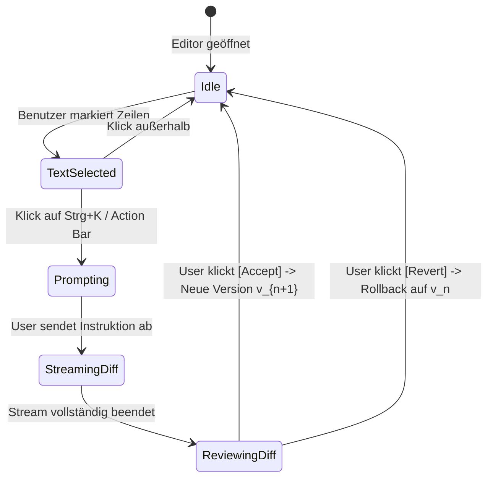

# Master-Entwurf: Dual-Pane Interactive Canvas and Artifacts (`dsh-canvas`)

## 1. Vision, Leitprinzipien & UX-Mental Model

### 1.1 Das Paradoxon des monolithischen Chat-Streams
In standardmäßigen KI-Code-Assistenten (DeepSeek Harness, Terminal-Agenten) teilt sich der sequenzielle Prompt-Verlauf denselben Bildschirmbereich mit seitenlangen Datei-Outputs. 
- Ein generiertes Modul von 400 Zeilen drängt den Konversationsfaden aus dem Blickfeld.
- Das Überprüfen einzelner Funktionsdeklarationen erfordert ständiges Hin- und Herscrollen.
- Möchte der Benutzer eine Änderung an einer bestimmten Funktion vornehmen, muss er dem LLM sprachlich mühsam erklären: *"Gehe zu Funktion XYZ in Zeile 180 und ändere dort..."*

### 1.2 Die Canvas-Philosophie: Lebende Dokumente im Neben-Workspace
Mit `dsh-canvas` wird die Konversation entkoppelt:
- **Linke Pane (Chat & Orchestrierung):** Der lineare Zeitstrahl von Gedanken, Tools, Erklärungen und Planungen.
- **Rechte Pane (Canvas Workspace):** Ein dynamischer, interaktiver Editor für *Artefakte* (Code-Dateien, Markdown-Spezifikationen, SVG/HTML Live-Previews).
- **Direkte Manipulation (Targeted In-Place Edits):** Der Benutzer markiert im Canvas einen Code-Block, drückt `Strg+K` (oder klickt auf die schwebende Toolbar), gibt einen Mikro-Prompt ein (*"Typisiere diese Funktion strikt mit Zod und fange Error-Cases ab"*), und der Agent wendet das Diff **in situ** direkt auf das Artefakt an.

---

## 2. Detailliertes UI- und UX-Design

### 2.1 Visuelles Layout und Responsive Split-Grid

```
+---------------------------------------------------------------------------------------------------------+
| [DSH Logo] Session: NixOS Flake Refactor   (Tailscale: jello -> rollins)              [Share] [Settings]|
+-------------------------------------------------------+-------------------------------------------------+
| CHAT CONVERSATION PANE (50%)                          | CANVAS WORKSPACE PANE (50%)                     |
|                                                       |                                                 |
| > User: Erstelle ein Redis Sentinel Cluster Modul     | [Tabs:  📄 redis-sentinel.nix  * |  📊 topology.svg ] |
|                                                       | [Toolbar:  v3 (Latest) ▾ | [Diff] | [Sync 💾] | [✕] ]|
| > DeepSeek Agent:                                     +-------------------------------------------------+
|   Ich habe das Modul strukturiert.                    | 1  { config, lib, pkgs, ... }:                  |
|   Siehe Artefakt im Canvas rechts.                    | 2  let                                          |
|                                                       | 3    cfg = config.services.redisSentinel;       |
|   ┌──────────────────────────────────────────────┐    | 4  in {                                         |
|   | 📄 [Artefakt: redis-sentinel.nix (v1)]       |    | 5    options.services.redisSentinel = {         |
|   | 84 Zeilen · Nix · Im Canvas geöffnet         |    | 6+     enable = lib.mkEnableOption "Sentinel";  |
|   └──────────────────────────────────────────────┘    | 7+     masterName = lib.mkOption {              |
|                                                       | 8+       type = lib.types.str;                  |
|   [✓ Tool: validate_syntax passed]                   | 9+       default = "mymaster";                  |
|                                                       | 10     };                                       |
|                                                       |    +---------------------------------------+    |
|                                                       | 11 | [Strg+K] Füge Quorum-Option hinzu... |    |
|                                                       |    +---------------------------------------+    |
|                                                       |                                                 |
+-------------------------------------------------------+-------------------------------------------------+
| [ + @file @diff ] Prompt eingeben...      [Send ↵]    | Workspace Path: features/services/redis-sentinel|
+-------------------------------------------------------+-------------------------------------------------+
```

### 2.2 Zustände und Übergänge des Split-Panes

1. **Collapsed Mode (Standardzustand / Chat First):**
   - Wenn kein Artefakt aktiv ist, nimmt der Chat 100% der horizontalen Breite ein (zentriert mit Lesebreite 840px).
   - Sobald der Agent ein Artefakt erzeugt oder der Benutzer eine Datei mit `@file` im Canvas inspizieren möchte, gleitet das Canvas-Pane flüssig von rechts herein (`transition: width 240ms cubic-bezier(0.16, 1, 0.3, 1)`).
2. **Dual-Pane Mode (50/50 Split):**
   - Ein robuster Drag-Handle (Divider mit Hover-Highlight) erlaubt stufenloses Verschieben der Pane-Breite zwischen `30% / 70%` und `70% / 30%`.
   - Ein Doppelklick auf den Divider zentriert exakt auf `50% / 50%`.
3. **Maximized Canvas Mode (Focus Work):**
   - Über einen Maximize-Button im Canvas-Header kann das Canvas auf 100% expandiert werden (z. B. für komplexe Reviews großer Dateien).
4. **Mobile / Viewport < 960px:**
   - Automatischer Wechsel von Side-by-Side auf Tab-Navigation im Header:
     `[ 💬 Chat ]  [ 📄 Canvas (1) ]`.

---

## 3. Kern-Features im Detail

### 3.1 Targeted Selection In-Place Prompting (Strg+K)
- **Ablauf:**
  1. Entwickler markiert Zeilen 40–55 im Code.
  2. Es erscheint eine schwebende Toolbar direkt über der Selektion: `[✨ Ask Agent (Strg+K)]  [📋 Copy]  [📌 Pin as Context]`.
  3. Beim Klick auf `Ask Agent` öffnet sich ein Inline-Prompt-Input mit Autocomplete.
  4. Der Prompt wird mit exaktem Range (`startLine, endLine`) und dem Dateikontext als Sub-Turn an das Modell gesendet.
  5. Das Modell streamt das Diff **direkt in die Zeilen des Editors** hinein.
  6. Nach dem Streaming sieht der Benutzer die Änderungen als visuelles Inline-Diff (Grün/Rot) mit zwei Buttons: `[✓ Accept (Strg+Enter)]` und `[✗ Revert (Esc)]`.

### 3.2 Live Preview & Interactive Artifact Renderers
Das Canvas unterstützt verschiedene Content-Typen:
- **Code (Monaco Editor / Prism):** Syntax-Highlighting für Nix, TypeScript, Python, Rust, Go, Bash, YAML, Markdown.
- **Sandboxed Web & HTML (`sandbox="allow-scripts"`):**
  - Isolierte Darstellung von HTML5/CSS/JS-Apps, Mockups oder UI-Prototypen.
  - Kommuniziert mit dem Host ausschließlich über sichere `postMessage`-Kanäle.
- **Mermaid & Graphviz Architecture Engine:**
  - Live-Kompilierung von Flowcharts, State-Diagrammen und Entity-Relationship-Diagrammen.
  - Zoom & Pan Unterstützung mit SVG-Export.
- **Rich Markdown & LaTeX:**
  - Rendern von Formeln, GFM-Tabellen, Callouts und interaktiven Tasklisten.

### 3.3 Time-Travel Version Ledger
Jedes Artefakt besitzt eine lückenlose Revisionskette:
- Jeder Agenten-Turn und jede manuelle Benutzerbearbeitung erzeugt eine Version `v1`, `v2`, `...`, `vn`.
- Über ein Dropdown im Header (`v3 (Latest) ▾`) kann blitzschnell auf historische Versionen zurückgesprungen werden.
- Ein `[Side-by-Side Diff]` Modus vergleicht zwei beliebige Versionen (`v1` vs. `v3`) direkt im Editor.

### 3.4 Bidirektionale Dateisystem-Synchronisation (CoW Integration)
- Artefakte können rein virtuell sein (z.B. flüchtige Architektur-Skizzen) oder **file-backed** (an einen Dateipfad im Workspace gebunden).
- Bei file-backed Artefakten:
  - Ein Klick auf `[Save / Sync 💾]` übernimmt den Inhalt über `dsh-workspace-tx` transaktional in das Workspace-Dateisystem.
  - Ändert sich die Datei extern auf der Festplatte, detektiert der Inotify-Watcher die Änderung und markiert das Artefakt als *Desynchronized* mit einer visuellen Auflösungsleiste.

---

## 4. Vollständiges Datenmodell und State-Machine

### 4.1 TypeScript Datenverträge

```typescript
export type ArtifactFormat = 'code' | 'markdown' | 'html' | 'svg' | 'mermaid' | 'diff';

export interface ArtifactSelectionRange {
  startLine: number;
  startColumn: number;
  endLine: number;
  endColumn: number;
}

export interface ArtifactVersionRecord {
  versionId: number;
  author: 'user' | 'agent' | 'external';
  timestamp: number;
  content: string;
  summary?: string;
  deltaSummary?: { added: number; removed: number };
}

export interface CanvasArtifactState {
  artifactId: string;
  sessionId: string;
  title: string;
  format: ArtifactFormat;
  language: string;
  workspacePath?: string;
  activeVersionId: number;
  versions: ArtifactVersionRecord[];
  isDirty: boolean;
  isStreaming: boolean;
  selection?: ArtifactSelectionRange;
}

export interface CanvasStoreState {
  openArtifactIds: string[];
  activeArtifactId: string | null;
  paneWidthPercent: number; // 20 bis 80, Default: 50
  isMaximized: boolean;
  isDiffModeActive: boolean;
  diffCompareVersionId?: number;
}
```

### 4.2 State Machine der interaktiven In-Place Bearbeitung



---

## 5. Systemintegration in DeepSeek Harness (`dsh`)

### 5.1 Cordis Service Registration (`backend`)
Das Backend-Plugin `features/dev/dsh/plugins/dsh-canvas/` registriert:
1. **RPC Endpunkte:**
   - `canvas.listArtifacts(sessionId)`
   - `canvas.createArtifact(sessionId, params)`
   - `canvas.updateArtifact(sessionId, artifactId, content, summary)`
   - `canvas.executeSelectionPrompt(sessionId, artifactId, range, prompt)`
   - `canvas.syncToDisk(sessionId, artifactId)`
2. **DSH Agent Tools (`dsh-tool-canvas`):**
   - `canvas_create_artifact(title, format, language, content, workspacePath)`
   - `canvas_update_artifact(artifactId, deltaOrContent, summary)`
   - `canvas_open_file_in_canvas(workspacePath)`

### 5.2 Slot-Komposition (`client`)
Der Web-Client klinkt sich nahtlos über die `@deepseek-ai/dsh-client-ui-slots` Architektur ein:
- **Slot `layout.main` oder `conversation.view`**:
  - `dsh-canvas` injiziert einen HOC/Layout-Wrapper um den residenten Chat-Scrollport.
  - Wenn `activeArtifactId !== null`, splitte den Container via Flexbox / CSS Grid.
- **Slot `conversation.chat.turnTail`**:
  - Rendert bei jedem Turn, in dem ein Artefakt verändert wurde, eine haptische *Artifact-Card* mit Button `[Im Canvas öffnen]`.
- **Slot `conversation.session.header.utilities`**:
  - Rendert ein Toggle-Icon `[ ◫ Canvas ]`, um das Pane manuell zu öffnen/schließen.

---

## 6. Edge Cases, Race Conditions & Resilience-Architektur

1. **Tipp-Kollision während des Agenten-Streams:**
   - *Problem:* Während das LLM Zeilen im Editor streamt, tippt der Benutzer gleichzeitig in die Datei.
   - *Lösung:* Der Editor aktiviert während `isStreaming: true` einen strikten Cursor-Lock mit subtilem Lade-Pulsieren. Bricht der Benutzer via `[Stop Generating]` ab, wird der Stream sofort gekappt und der Editor wieder editierbar.
2. **Verlust ungespeicherter Daten bei Browser-Crash:**
   - *Problem:* Der Tab stürzt ab oder der Benutzer schließt das Fenster versehentlich.
   - *Lösung:* Der gesamte Canvas-Zustand (inklusive noch ungespeicherter Puffer) wird mit 300ms Debounce in `IndexedDB` gespiegelt und beim Re-Mount nahtlos rehydriert.
3. **Extreme Artefakt-Größen (> 50.000 Zeilen):**
   - *Problem:* Das Parsen von Riesen-Dateien blockiert den React-Render-Loop.
   - *Lösung:* Monaco Editor Virtualized Windowing. Dateien über 2 MB deaktivieren automatische Bracket-Colorization und schalten auf Chunk-basiertes Diffing um.
4. **Sandboxed Iframe Security:**
   - *Problem:* Der Agent erzeugt böswilliges JavaScript im HTML-Preview-Modus.
   - *Lösung:* Der Preview-Iframe wird mit `sandbox="allow-scripts"` ohne `allow-same-origin` ausgeliefert. Cookies, LocalStorage und IndexedDB des DSH-Origins sind für den Iframe unzugänglich.

---

## 7. Phasen- und Implementierungsplan

- **Phase 1: Foundation & Data Architecture**
  - Erstellung von `features/dev/dsh/plugins/dsh-canvas/` (Node-Service + SQLite Persistence).
  - Deklaration der DSH Agent Tools (`canvas_create_artifact`, `canvas_update_artifact`).
- **Phase 2: Client Split-Pane Shell & Monaco Engine**
  - Implementierung des Split-Pane Layout Managers mit Slider-Divider und Animationen.
  - Integration des Monaco Editors mit Tab-Navigation und Versions-Wechsler.
- **Phase 3: Interactive Strg+K Selection Flow**
  - Implementierung der schwebenden Selection-Action-Bar.
  - Sub-Turn RPC Stream für In-Place Diffs mit Accept/Revert UI.
- **Phase 4: Live Previews (HTML / SVG / Mermaid)**
  - Sandboxed Iframe Provider für Web-Previews und Mermaid-Visualisierer.
- **Phase 5: NixOS Modul-Integration & CI Validation**
  - Option `my.features.dev.dsh.plugins.dsh-canvas.enable` in `default.nix`.
  - Flake-Check und Evaluierungstests auf allen 5 Hosts.
