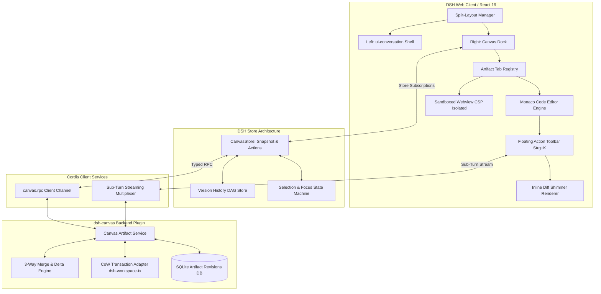

# Formale Spezifikation: Dual-Pane Interactive Canvas & Artifacts (`dsh-canvas`)

## 1. Ergonomie-Philosophie, Mental Model & Human-Agent Interaction (HAI)

### 1.1 Kognitive Entkopplung: Ephemere Konversation vs. Persistente Artefakte
Klassische Chat-Interfaces zwingen Benutzer und Sprachmodell in ein **lineares Append-Only-Paradigma**. Für die Softwareentwicklung ist dies kognitiv destruktiv:
1. **Verlust des visuellen Ankers:** Ein 300-Zeilen-Modul verdrängt den Problemkontext und vorherige Instruktionen aus dem Sichtfeld.
2. **Indirekte Adressierung:** Modifikationen erfordern sprachliche Hilfskonstruktionen (*"Gehe zu Funktion `resolveToken` in Zeile 45 und..."*), was zu Mehrdeutigkeiten, Latenz und Token-Verschwendung führt.
3. **Schreib-Lese-Asymmetrie:** Code wird sequenziell gelesen, aber punktuell editiert.

`dsh-canvas` löst dieses Paradoxon durch die **strikte Trennung von Diskurs- und Artefaktebene**:
- **Diskursebene (Left Pane, $P_{\text{chat}}$):** Sequenzieller Stream für Absichtsbekundungen, Planungen, Tool-Ausführungen und Erklärungen.
- **Artefaktebene (Right Pane, $P_{\text{canvas}}$):** Reaktive Arbeitsfläche für lebendige Dokumente, Code, Schemata und Previews.
- **Punktuelle Manipulation:** Direkte Selektion von Entitäten im Canvas mit gezieltem In-Place Refactoring ($V_{\text{target}} \to V_{\text{target}}'$).

---

## 2. Formale System- und Modul-Architektur

### 2.1 Schichtenmodell und Datenfluss



### 2.2 Formale Concurrency & Revisions-Algebra

Ein Artefakt $A$ ist ein gerichteter azyklischer Revisionsgraph:
$$\mathcal{G}_A = (\mathcal{V}, \mathcal{E}), \quad \mathcal{V} = \{v_0, v_1, \dots, v_n\}$$

Jede Version $v_k \in \mathcal{V}$ ist definiert als Tupel:
$$v_k = \langle \text{id}, \text{author}, t, \text{content}, \sigma, \pi \rangle$$
wobei:
- $\text{author} \in \{\text{User}, \text{Agent}, \text{ExternalWatcher}\}$,
- $t \in \mathbb{R}^+$ der logische Timestamp ist,
- $\text{content} \in \Sigma^*$ die Zeichenkette des Dokuments darstellt,
- $\sigma = \text{SHA-256}(\text{content})$ der kryptografische Integritäts-Hash ist,
- $\pi \subseteq \mathcal{V}$ die Menge der Elternknoten ist (bei linearen Edits $|\pi| = 1$, bei Merges $|\pi| = 2$).

#### Three-Way Merge bei nebenläufigen Mutationen
Tritt eine Mutation durch den Agenten $\Delta_A$ auf Basis von $v_{\text{base}}$ ein, während gleichzeitig eine Benutzer- oder Dateisystem-Mutation $\Delta_U$ vorliegt, berechnet die Engine:
$$v_{\text{merged}} = \text{merge3}(v_{\text{base}}, v_{\text{base}} \oplus \Delta_U, v_{\text{base}} \oplus \Delta_A)$$

- **Konfliktfreie Hunks:** Werden automatisch und verlustfrei angewendet.
- **Konfliktbehaftete Hunks:** Werden im Monaco-Diff-Editor als interaktive Konfliktzonen dargestellt:
  ```
  <<<<<<< USER DRAFT
  export const port = 8080;
  =======
  export const port = lib.mkDefault 8080;
  >>>>>>> AGENT REFACTOR
  ```

---

## 3. Typisierte Slot-Integration in DSH

Um vollständige Modularität zu garantieren, wird kein bestehender Upstream-Code verändert. Die Einbindung erfolgt über die `@deepseek-ai/dsh-client-ui-slots` Typen- und Komponenten-Erweiterung:

```typescript
// features/dev/dsh/plugins/dsh-canvas/src/client/contract/slots.ts
import type { PropsRuntime, PropsStore, InjectFace, PropsLocale } from '@deepseek-ai/dsh-client-ui-slots';
import type { CanvasStore } from './store.js';

export interface CanvasSlotOwnerProps {
  sessionId: string;
  activeArtifactId: string | null;
  onCloseCanvas: () => void;
  onSyncWorkspace: (artifactId: string) => Promise<void>;
}

export interface CanvasEditorInjected {
  executeSelectionPrompt: (artifactId: string, range: SelectionRange, prompt: string) => Promise<void>;
  acceptHunk: (hunkId: string) => void;
  rejectHunk: (hunkId: string) => void;
}

declare module '@deepseek-ai/dsh-client-ui-slots' {
  interface LocaleNamespaceMap {
    'canvas': 'title' | 'sync' | 'diff' | 'accept' | 'reject' | 'preview';
  }

  interface SlotMap {
    /** Root-Slot für das Canvas-Split-Dock */
    'conversation.canvas.dock': {
      kind: 'single';
      scope: 'session';
      owner: CanvasSlotOwnerProps;
      store: CanvasStore;
      inject: CanvasEditorInjected;
    };

    /** Renderer für interaktive Artefakt-Karten in der Chat-Timeline */
    'conversation.chat.artifact-badge': {
      kind: 'keyed';
      scope: 'session';
      owner: {
        artifactId: string;
        versionId: number;
        title: string;
        language: string;
        summary?: string;
      };
    };
  }
}
```

---

## 4. Detailliertes UI/UX- und Interaktions-Design

### 4.1 Split-Pane Layout & Fluid Mechanics

```
+--------------------------------------------------------------------------------------------------------------------+
| [DSH] Session: Flake Architecture Refactor               (Tailscale: jello -> rollins)          [Share] [Settings] |
+-------------------------------------------------------------+------------------------------------------------------+
| CHAT CONVERSATION PANE (50%)                                | CANVAS ARTIFACT PANE (50%)                           |
|                                                             |                                                      |
| > User: Baue ein Modul für den Prometheus Node-Exporter     | [Tabs:  📄 node-exporter.nix * |  📊 topology.mermaid] |
|                                                             | [Bar:   v2 (Agent) ▾ | [⇄ Diff] | [💾 Sync] | [⛶ Max] ]|
| > DeepSeek Agent:                                           +------------------------------------------------------+
|   Ich habe das Modul strukturiert und auf Port-             | 1   { config, lib, pkgs, ... }:                      |
|   Kollisionen geprüft.                                      | 2   let                                              |
|                                                             | 3     cfg = config.my.features.monitoring.exporter;  |
|   ┌─────────────────────────────────────────────────────┐   | 4   in {                                             |
|   | 📄 [Artefakt: node-exporter.nix]                    |   | 5     options.my.features.monitoring.exporter = {    |
|   | 62 Zeilen · NixOS Modul · [Im Canvas fokussieren ↗] |   | 6+      enable = lib.mkEnableOption "node-exporter"; |
|   └─────────────────────────────────────────────────────┘   | 7+      port = lib.mkOption {                        |
|                                                             | 8+        type = lib.types.port;                     |
|                                                             | 9+        default = 9100;                            |
|                                                             | 10      };                                           |
|                                                             |     +------------------------------------------+     |
|                                                             | 11  | ✨ [Strg+K] Füge TLS-Optionen hinzu...   |     |
|                                                             |     +------------------------------------------+     |
|                                                             |                                                      |
+-------------------------------------------------------------+------------------------------------------------------+
| [ + @file @diff ] Schreibe eine Nachricht...       [Send ↵] | Workspace: features/services/monitoring/exporter.nix |
+-------------------------------------------------------------+------------------------------------------------------+
```

### 4.2 Keyboard-First Ergonomie & Focus-Management
Für professionelle Entwickler ist das unterbrechungsfreie Bedienen ohne Maus zwingend:

| Shortcut | Kontext | Aktion |
|---|---|---|
| `Alt + C` | Global | Setzt Tastaturfokus sofort in die Chat-Composer-Zeile. |
| `Alt + E` | Global | Setzt Tastaturfokus in den Monaco-Editor des Canvas. |
| `Strg + K` | Canvas (Text selektiert) | Öffnet die schwebende In-Place Prompt-Bar über der Selektion. |
| `Strg + Enter` | In-Place Prompt-Bar | Führt den Sub-Turn aus / wendet generierte Hunks an (`Accept All`). |
| `Escape` | In-Place Prompt-Bar / Diff | Bricht den aktuellen Vorgang ab / verwirft das generierte Diff (`Reject All`). |
| `Alt + M` | Canvas | Maximiert das Canvas auf 100% Breite bzw. kehrt zum 50/50 Split zurück. |
| `Alt + W` | Canvas | Schließt das aktive Canvas-Artefakt. |

---

## 5. Security Sandbox Architecture (Zero-Exfiltration Invariant)

Für Live-Previews von HTML5, JavaScript und SVG-Diagrammen gilt die strikte **Zero-Exfiltration-Invariante**:

### 5.1 CSP & Iframe Sandboxing
```html
<iframe
  srcdoc="..."
  sandbox="allow-scripts"
  referrerpolicy="no-referrer"
  csp="
    default-src 'none';
    script-src 'unsafe-inline';
    style-src 'unsafe-inline';
    img-src data: blob:;
    font-src data:;
    connect-src 'none';
    frame-src 'none';
    object-src 'none';
  "
></iframe>
```

### 5.2 Formale Sicherheitsgarantien
1. **Keine Netzwerkkonnektivität (`connect-src 'none'`):** Das gerenderte Skript kann unter keinen Umständen Daten per `fetch()`, `XMLHttpRequest` oder `WebSocket` an externe Server senden.
2. **Keine Cookie-/Storage-Vererbung (fehlendes `allow-same-origin`):** Der Iframe läuft in einem eindeutigen, opaken Ursprung (`null`). Zugriff auf `window.localStorage`, `IndexedDB` oder Session-Cookies des Hosts ist physisch unmöglich.
3. **Kryptografisch versiegelter MessageChannel:** Ereignisse zwischen Canvas-Shell und Iframe fließen ausschließlich über einen bidirektionalen `MessagePort`, der mit einer sitzungsspezifischen Nonce validiert wird.

---

## 6. Vollständige Edge-Case & Resilienz-Matrix

| Edge Case | Fehlerklasse | Erkennungsmechanismus | Formale Behebungsstrategie |
|---|---|---|---|
| **Externe Dateisystem-Mutation** | State Drift | Inotify / `chokidar` Event auf `workspacePath`. | Prüfe $\text{SHA-256}(\text{disk})$. Wenn ungleich $v_{\text{active}}$, erzeuge $v_{\text{external}}$ im DAG und zeige nicht-blockierendes Banner: `[Disk geändert: Diff anzeigen | Überschreiben]`. |
| **Streaming-Abbruch / Timeout** | Partial State | Abrupter Websocket-Close oder User `[Stop]`. | Der unfertige Puffer wird als flüchtiger Entwurf isoliert. Der Editor rollt deterministisch auf den exakten Zustand vor Stream-Beginn ($v_k$) zurück. |
| **Riesige Artefakte (> 20 MB / 200k Zeilen)** | Memory / OOM | Dateigrößen-Check vor Instanziierung. | Automatischer Wechsel in den **Virtual Chunked Reader**. Monaco minimiert Syntax-Trees; AST-Features werden auf sichtbare Viewport-Fenster beschränkt. |
| **DOM-Reflow bei Split-Resize** | Layout Thrashing | ResizeObserver mit 60fps Throttle. | Canvas-Divider nutzt CSS `transform: translate3d` anstelle kontinuierlicher Reflows über `width`-Prozentsätze. Erst beim Loslassen des Drag-Handles erfolgt der finale Layout-Commit. |
| **Offline- / Refresh-Resilienz** | Data Loss | `beforeunload`-Event & State-Flush. | Jeder Tastenanschlag im Editor wird mit 250ms Debounce in eine sitzungsgebundene `IndexedDB` gestreamt. Nach Browser-Crash steht der exakte Editor-Zustand sofort wieder zur Verfügung. |

---

## 7. Phasen- und Implementierungsplan

- **Phase 1: Backend Plugin & Datenmodell (`features/dev/dsh/plugins/dsh-canvas/`)**
  - Deklaration des Cordis Service `canvas` mit SQLite-DAG-Persistenz.
  - Bereitstellung der DSH Agent Tools (`canvas_create_artifact`, `canvas_update_artifact`, `canvas_get_artifact`).
- **Phase 2: Client Split-Dock & Monaco Engine**
  - Implementierung des Split-Pane Layout Managers mit CSS Transform Drag-Handle.
  - Einbindung des Monaco Editors mit Theme-Synchronisation (Dark/Light).
- **Phase 3: Interactive Strg+K In-Place Streaming Flow**
  - Schwebende Action-Bar für markierte Zeilen.
  - Streaming Sub-Turn Protokoll mit visuellen Inline-Hunks und Shimmering.
- **Phase 4: Sandboxed Previews & Visualizers**
  - CSP-abgesicherter Iframe-Runner für HTML5/JS.
  - Mermaid- und SVG-Renderer mit Zoom-, Pan- und Export-Funktionalität.
- **Phase 5: NixOS Integration & Systemweite Validierung**
  - Deklaratives Modul `my.features.dev.dsh.plugins.dsh-canvas.enable = true;`.
  - Verifikation aller 5 Hosts via `nix flake check`.
