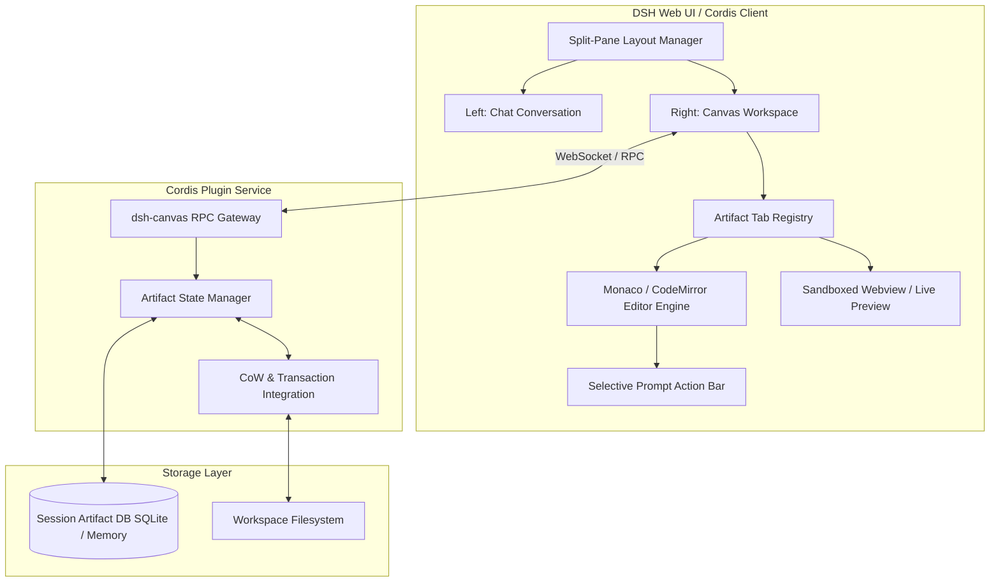

# Dual-Pane Interactive Canvas and Artifacts (`dsh-canvas`)

## 1. Executive Summary and Motivation

Moderne LLM-basierte Entwicklungs- und Code-Harnesses (wie z. B. Claude Code Desktop, OpenAI Canvas, Cursor Composer) trennen zunehmend den sequenziellen Konversationsverlauf (Chat-Pane) von iterierbaren, lebendigen Code-Artefakten (Canvas-Pane). 

Im bestehenden DeepSeek Harness (`dsh`) fließen Datei-Inhalte und Diff-Blöcke primär als Inline-Markdown (`markdown-code-block`) durch den linearen Nachrichtenstrom. Dies führt bei umfangreichen Dateien zu:
- Kontextverlust und hohem Scroll-Aufwand im Chat.
- Erschwerter simultaner Referenzierung („Chatten während man Codezeilen betrachtet“).
- Fehlender Möglichkeit, selektiv Codebereiche zu markieren und gezielte Refactoring-Prompts („Targeted In-Place Edits“) darauf auszuführen.

Das Feature **`dsh-canvas`** erweitert die DSH-Architektur um ein modulares, reaktives Dual-Pane-Canvas-System, das als Plugin realisiert wird, ohne das Kernpaket von DSH zu verändern.

---

## 2. System- und Modul-Architektur

### 2.1 Schichten-Modell



### 2.2 Integration in das Cordis- und DSH-Ecosystem

1. **DSH Client Extension Point**:
   - DSH exportiert im `@deepseek-ai/dsh-ui-conversation` Modul die `conversation.view`-Slot-Schnittstelle (`createConversationStore`, `openView(view, focus)`).
   - `dsh-canvas` registriert einen primären View-Provider `canvas:artifact-viewer`.
   - Bei Erzeugung eines Artefakts (oder wenn ein Tool ein File öffnet) feuert das Backend ein `canvas/open`-Event.

2. **Backend Plugin (`features/dev/dsh/plugins/dsh-canvas/`)**:
   - Stellt einen Cordis-Service `canvas` bereit.
   - Verwaltet flüchtige und persistente Artefakt-Zustände pro Session.
   - Bietet RPC-Endpunkte:
     - `canvas.getArtifact(sessionId, artifactId)`
     - `canvas.updateArtifact(sessionId, artifactId, delta, userVersion)`
     - `canvas.executeSelectionPrompt(sessionId, artifactId, range, prompt)`
     - `canvas.applyToWorkspace(sessionId, artifactId, targetPath)`

3. **Verbindung zu `dsh-workspace-tx`**:
   - Wenn ein Artefakt aus dem Canvas ins Workspace-Dateisystem übernommen werden soll, geschieht dies über eine `workspace_tx_stage_write`-Transaktion mit Optimistic Concurrency Control (OCC).

---

## 3. Datenmodell und Protokoll

### 3.1 Artefakt-Entität

```typescript
export type ArtifactType = 'code' | 'markdown' | 'svg' | 'html' | 'json';

export interface ArtifactVersion {
  version: number;
  content: string;
  source: 'agent' | 'user' | 'merge';
  timestamp: number;
  commitMessage?: string;
}

export interface CanvasArtifact {
  id: string;                      // Eindeutige UUID
  sessionId: string;               // Gebunden an die DSH-Session
  name: string;                    // Dateiname / Anzeigename, z.B. "auth-service.ts"
  type: ArtifactType;
  language: string;                // Syntax-Highlighting (z.B. "typescript", "nix")
  path?: string;                   // Reales Workspace-Dateiziel (falls file-backed)
  activeVersion: number;
  versions: ArtifactVersion[];
  isDirty: boolean;                // Weicht Zustand vom Workspace-File ab?
  metadata: {
    originMessageId?: string;
    tokenCount?: number;
    readOnly?: boolean;
  };
}
```

### 3.2 Selective Prompting Payload

Wenn der Entwickler im Editor Zeilen 42–58 markiert und einen Inline-Prompt sendet:

```json
{
  "jsonrpc": "2.0",
  "method": "canvas.executeSelectionPrompt",
  "params": {
    "sessionId": "sess_8f91a2bc",
    "artifactId": "art_c4b901",
    "selection": {
      "startLine": 42,
      "startColumn": 1,
      "endLine": 58,
      "endColumn": 30,
      "selectedText": "export async function verifyToken(req: Request) { ... }"
    },
    "userInstruction": "Refaktoriere auf asynchrone WebCrypto-API und fange JOSE-Fehler sauber ab."
  }
}
```

---

## 4. Szenarien

### Szenario A: Single-File Iteration & Refactoring
1. Der Benutzer bittet den Agenten: *"Erstelle einen neuen NixOS-Service für Grafana-Loki."*
2. Der Agent generiert das Modul nicht als unübersichtlichen Monolithen im Chat, sondern ruft `canvas_create_artifact` auf.
3. Die UI öffnet automatisch das rechte Canvas-Pane (`width: 50%`) mit Syntax-Highlighting für Nix.
4. Der Benutzer klickt auf eine Option-Definition im Editor, drückt `Strg+K` (oder klickt auf die schwebende Toolbar) und tippt: *"Füge hier noch eine Assertion für Port-Kollisionen ein."*
5. Der Agent führt ein gezieltes Diff nur auf den selektierten Bereich aus; die Versionshistorie springt von v1 auf v2 mit visuellem Inline-Diff.

### Szenario B: Sandboxed Live Preview (HTML / SVG / React / Mermaid)
1. Der Agent generiert ein Architekturdiagramm (Mermaid) oder einen Web-Prototyp.
2. Das Canvas-Pane erkennt den Typ (`html` oder `svg`) und bietet einen Umschalter `[Code | Preview]`.
3. Die Preview läuft in einem isolierten `iframe` (`sandbox="allow-scripts"` ohne Netzzugriff und ohne Zugriff auf `parent.localStorage`), um Cross-Site Scripting (XSS) und Token-Exfiltration auszuschließen.

### Szenario C: Split-Screen Workspace Sync
1. Ein Entwickler editiert Code im Canvas manuell.
2. Der Benutzer klickt auf `Sync to Workspace`.
3. Es wird automatisch ein transaktionales CoW-Diff gegen das lokale Dateisystem validiert. Bei Erfolg wird die Datei geschrieben und ein Eintrag im Git-Tree vorbereitet.

---

## 5. Edge Cases und Fehlerbehandlung

| Edge Case | Risiko | Architektonische Lösung |
|---|---|---|
| **Dateisystem-Drift (Externer Edit)** | Workspace-Datei wird extern (z.B. in Neovim/Codium) geändert, während der Benutzer sie im Canvas betrachtet. | `chokidar` / Inotify File-Watcher im Backend. Meldet `file:modified`-Event an das Canvas. Canvas zeigt Notification-Banner: *"Datei auf Festplatte wurde geändert. [Diff anzeigen] [Überschreiben] [Neu laden]"*. |
| **Gleichzeitige Bearbeitung (Agent vs. User)** | Der Agent streamt ein Artefakt-Update, während der Benutzer im Monaco-Editor tippt. | Lock-Mechanismus während des Agenten-Streams. Der Editor geht temporär in `readOnly: true` mit Streaming-Cursor. Bricht der User ab, wird der Stream terminiert und der Benutzer erhält Schreibrechte zurück. |
| **Extrem große Dateien (> 100k Zeilen)** | DOM-Überlastung, Browser-Tab friert ein. | Virtuelles Scrolling via Monaco/CodeMirror. Dateien > 2 MB werden im Canvas mit einem Hinweis im „Read-Only / Chunked Mode“ geöffnet. |
| **Responsive Breakpoints (Mobile / schmale Bildschirme)** | Unter 900px Fensterbreite ist ein Split-Pane unbedienbar. | Automatischer Wechsel auf Tab-Modus (`[Chat] | [Canvas (1)]`). Ein Floating Badge zeigt an, wenn im Hintergrund ein Artefakt generiert wurde. |
| **Session-Reload & State-Persistence** | Browser-Refresh leert ungespeicherte Canvas-Bearbeitungen. | Der Canvas-Zustand (inklusive aller unbestätigten lokalen Diffs) wird im IndexedDB des Clients sowie als Draft-Zustand in der SQLite-Datenbank der Session persistiert. |

---

## 6. NixOS & Feature Deklaration

Das Feature wird rein additiv in NixOS definiert:

```nix
my.features.dev.dsh.plugins.dsh-canvas = {
  enable = true;
  settings = {
    defaultPaneWidth = 50; # Prozent
    enableLivePreview = true;
    monacoTheme = "vs-dark";
    maxArtifactSizeBytes = 5242880; # 5 MB
  };
};
```
