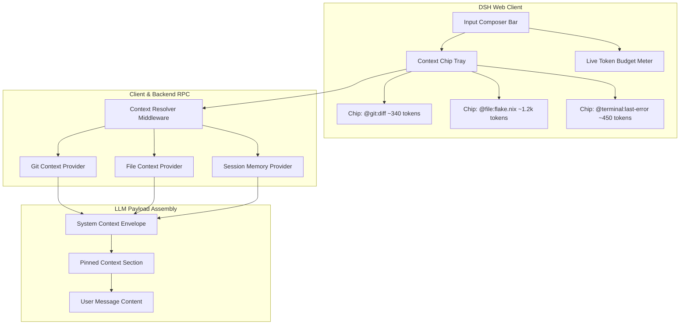

# Active Context Chips and Git Diff Pinning (`dsh-context-chips`)

## 1. Executive Summary and Motivation

In Standard-Chat-Oberflächen ist der effektive Kontext für den Benutzer oft eine "Black Box":
- Es ist unklar, welche Dateien, Git-Diffs oder Shell-Ausgaben der Agent im aktuellen Request tatsächlich "sieht".
- Die Eingabezeile (Composer) erlaubt zwar `@file` und `@session`, aber es fehlt eine sichtbare, interaktive **Token-Budget-Visualisierung** und die Möglichkeit, **aktive Git-Zustände** explizit an die Eingabe zu pinnen.
- Ohne Pinning muss der Agent bei jeder Frage nach dem aktuellen Entwicklungsstand manuell `git status` oder `git diff` über Bash-Tools abfragen, was Latenz, Token-Kosten und Halluzinationsrisiken erhöht.

Das Feature **`dsh-context-chips`** führt ein visuelles und semantisches Kontext-Management-System direkt im DSH-Composer ein:
1. **Interaktive Kontext-Chips**: Gepinnte Dateien, Git-Diffs und Session-Zweige als entfernbare Badges ("Pills") über dem Prompt-Input.
2. **First-Class Git Mentions**: `@git:diff`, `@git:staged`, `@git:branch`, `@git:commit[sha]`.
3. **Live Token-Budget Bar**: Echtzeit-Berechnung des Context-Windows (z.B. `14.2k / 128k Tokens (11%)`).

---

## 2. System- und Modul-Architektur

### 2.1 Schichten-Modell



### 2.2 Integration in das Cordis- und DSH-Ecosystem

1. **Composer Erweiterung (`ui-reference` / `@mention`)**:
   - DSH besitzt bereits `ui-reference` mit Vorschlägen für `@`.
   - `dsh-context-chips` erweitert diesen Provider um:
     - `@diff` oder `@git:diff`: Erzeugt dynamisch einen Diff-Snapshot des uncommitted Worktrees.
     - `@staged`: Nur gestagte Änderungen (`git diff --cached`).
     - `@recent`: Die zuletzt im Editor geöffneten oder modifizierten Dateien.
   - Wenn eine Referenz gewählt wird, wandelt sie der Composer optional in einen fixierten "Pinned Chip" um, der für alle folgenden Prompts in der Session aktiv bleibt (Pin-Symbol 📌).

2. **Backend Plugin (`features/dev/dsh/plugins/dsh-context-chips/`)**:
   - Cordis Service `context_provider`.
   - Endpunkt `context.resolve(sessionId, chips: ContextChipRef[])`:
     - Führt atomare, read-only Git-Operationen über `nodegit` oder `git`-Binary aus.
     - Liest Datei-Inhalte mit intelligentem Chunking.
     - Berechnet BPE-Tokens (z.B. via `tiktoken` oder DeepSeek-Tokenizer).
   - Endpunkt `context.streamTokenEstimates(sessionId, promptDraft, chips)`:
     - Debounced Websocket-Stream für die Live-Fortschrittsanzeige im UI.

---

## 3. Datenmodell und Protokoll

### 3.1 Chip-Definition

```typescript
export type ChipType = 'file' | 'git-diff' | 'git-staged' | 'git-commit' | 'terminal' | 'memory-node';

export interface ContextChip {
  id: string;                      // Eindeutige Instanz-ID
  type: ChipType;
  label: string;                   // z.B. "git:diff (+42 -12)", "roles/server.nix"
  uri: string;                     // e.g. "git://diff", "file:///etc/nixos/flake.nix"
  pinned: boolean;                 // Bleibt für nachfolgende Prompts erhalten
  tokenCount: number;              // Berechnete Token
  valid: boolean;                  // Existiert die Ressource noch?
  stalenessWarning?: boolean;      // Wurde git commit ausgeführt seit Pinning?
  contentSnapshot?: string;        // Fixierter Snapshot oder lazy-resolved
}
```

### 3.2 Kontext-Envelope im LLM Prompt

Gepinnte Kontext-Chips werden nicht einfach unstrukturiert an den Text angehängt, sondern als standardisierter XML/Markdown-Envelope vor die User-Message injiziert:

```markdown
<pinned_context>
  <context_source type="git-diff" target="HEAD" tokens="340">
    diff --git a/features/dev/dsh/default.nix b/features/dev/dsh/default.nix
    --- a/features/dev/dsh/default.nix
    +++ b/features/dev/dsh/default.nix
    @@ -42,3 +42,5 @@
    +  my.features.dev.dsh.plugins.dsh-canvas.enable = true;
  </context_source>
  
  <context_source type="file" path="/etc/nixos/flake.nix" tokens="1250">
    {
      description = "NixOS Flake";
      ...
    }
  </context_source>
</pinned_context>

Hier ist meine Frage zum oben gepinnten Diff: Warum schlägt die Evaluation fehl?
```

---

## 4. Szenarien

### Szenario A: Reviewing Uncommitted Changes
1. Der Entwickler hat in 4 verschiedenen NixOS-Modulen gearbeitet und tippt im DSH-Composer: `@diff`.
2. Das System erzeugt sofort eine Pill: `[📌 git:diff (+120 -35) | 1.8k tok ✕]`.
3. Der Token-Balken springt von `2.1k` auf `3.9k / 128k (3%)`.
4. Der User fragt: *"Schau über diesen Diff und prüfe, ob AGENTS.md Regeln (keine hartcodierten Usernamen) verletzt werden."*
5. Der Agent erhält direkt den exakten Diff, ohne Shell-Tools ausführen zu müssen, und antwortet mit Sub-Sekunden-Latenz.

### Szenario B: Pinned Multi-File Reference über mehrere Prompt-Turns
1. Für ein großes Refactoring pinnt der Benutzer `@file:flake.nix` und `@file:roles/base.nix`.
2. Die Chips bleiben in der UI verankert.
3. Über 5 aufeinanderfolgende Chat-Turns hat der Agent diesen Kontext garantiert im Fokus, ohne dass der Benutzer die Dateien erneut erwähnen oder copy-pasten muss.
4. Nach Abschluss klickt der Benutzer auf `Clear Pinned Chips`.

### Szenario C: Stale Diff Warning
1. Der Entwickler hat `@git:diff` gepinnt.
2. Im Hintergrund führt er im Terminal `git commit -am "wip"` aus.
3. Der Inotify/Git-Watcher meldet eine Änderung des Git-Index.
4. Der Chip färbt sich orange mit einem Warn-Icon: *"Git Index hat sich geändert. [Snapshot aktualisieren]"*.

---

## 5. Edge Cases und Fehlerbehandlung

| Edge Case | Risiko | Architektonische Lösung |
|---|---|---|
| **Riesige Git Diffs (> 100k Zeilen)** | Token-Overflow, Kontextfenster des LLM wird gesprengt. | Automatisches Diff-Compacting: Wenn `diff > 10.000 Tokens`, schaltet der Resolver auf `@git:stat` (Dateiliste + Hunk-Statistiken) um und fügt einen Hinweis ein: *"Diff zu groß für Volltext. Selektieren Sie spezifische Dateien via @file."* |
| **Binäre Dateien im Git Diff** | Nicht lesbare Binärdaten im Prompt (`PNG`, `PDF`, `.lock`). | Filterung: Binäre Diffs werden als `Binary file [x.png] differs` ohne Raw-Bytes zusammengefasst. |
| **Gelöschte oder umbenannte Dateien** | Der Chip referenziert einen Pfad, der nicht mehr existiert. | Graceful Degradation: Chip markiert sich als `[Stale / Missing]`; Resolver warnt im System-Prompt, bricht aber nicht den gesamten Request ab. |
| **Token-Überlauf des Kontext-Fensters** | Summe aus Pinned Chips + Chat-History übersteigt das Model-Limit. | Hard-Cap & Warnmeldung: Der Composer deaktiviert den Absenden-Button, hebt die Token-Leiste rot hervor und bietet einen `[Auto-Prune]`-Vorschlag (entfernt die ältesten unpinned History-Nachrichten). |

---

## 6. NixOS & Feature Deklaration

```nix
my.features.dev.dsh.plugins.dsh-context-chips = {
  enable = true;
  settings = {
    maxPinnedTokens = 32768;
    autoDetectGit = true;
    defaultBudgetModel = "deepseek-coder";
    showStaleWarnings = true;
  };
};
```
