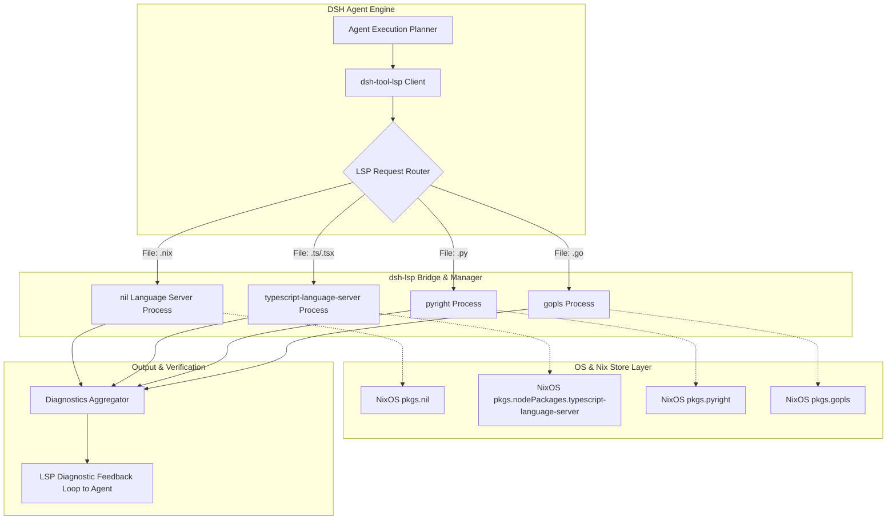

# Declarative LSP Code Intelligence (`dsh-lsp`)

## 1. Executive Summary and Motivation

Sprachmodelle erzeugen Code häufig auf Basis probabilistischer Textvorhersagen. Ohne eine exakte semantische Validierungsschicht (AST-Analyse, Typüberprüfung, Symbol-Auflösung) treten typische Fehler auf:
- Ungültige Importe oder fehlende Module.
- Halluzinierte Methoden-Signaturen und Typ-Inkompatibilitäten.
- Mangelndes Verständnis für host-weite oder projektweite Symbolstrukturen.

Das DeepSeek Harness bringt im Core bereits grundlegende Schnittstellen für Language Server Protocols mit (`@deepseek-ai/dsh-lsp`, `dsh-lsp-stdio`, `dsh-tool-lsp`). Allerdings fehlen:
1. **Deklarative Multi-Server-Orchestrierung** (automatische Zuordnung von `nil` für Nix, `gopls` für Go, `pyright` für Python, `tsserver` / `vtsls` für TypeScript).
2. **NixOS-Systemintegration**: Nahtloses Einbinden von Binaries direkt aus dem Nix-Store (`pkgs.nil`, `pkgs.gopls`, etc.), ohne dass Node-Module global oder ad-hoc heruntergeladen werden müssen.
3. **Agentic Code Verification Loop**: Automatische Abfrage von LSP-Diagnostics (Errors & Warnings) vor und nach Werkzeugausführungen.

Das Feature **`dsh-lsp`** realisiert diese semantische Intelligenzschicht vollkommen deklarativ und reproduzierbar.

---

## 2. System- und Modul-Architektur

### 2.1 Schichten-Modell



### 2.2 Integration in das Cordis- und DSH-Ecosystem

1. **Deklarative Konfiguration via NixOS Module**:
   - NixOS deklariert die aktiven Language Server in `my.features.dev.dsh.lsp.servers`.
   - Die Binaries werden über Nix-Store-Pfade aufgelöst (z.B. `${pkgs.nil}/bin/nil`), was absolute Reproduzierbarkeit garantiert.

2. **DSH RPC & Tool-Layer**:
   - Die existierenden DSH-Tools werden voll aktiviert:
     - `lsp_go_to_definition(path, line, character)`
     - `lsp_find_references(path, line, character)`
     - `lsp_hover(path, line, character)`
     - `lsp_diagnostics(path)`
   - Ergänzung: **Pre-Commit / Pre-Apply Verification Tool**:
     - Bevor ein Workspace-Transaction-Write ausgeführt wird, sendet DSH den virtuellen Puffer via `textDocument/didOpen` an den zuständigen LSP-Server.
     - Gibt der LSP fatale Syntax- oder Type-Errors zurück, wird der Agent sofort darauf aufmerksam gemacht und korrigiert den Code autonom im Entwurfsstadium.

---

## 3. Datenmodell und Server-Registry

### 3.1 Server-Definition in TypeScript / JSON

```typescript
export interface LspServerConfig {
  id: string;                      // z.B. "nil-nix", "vtsls-typescript"
  command: string;                 // Absoluter Pfad im Nix Store
  args: string[];                  // z.B. ["--stdio"]
  filePatterns: string[];          // z.B. ["**/*.nix"]
  rootMarkers: string[];           // z.B. ["flake.nix", ".git"]
  initializationOptions?: Record<string, unknown>;
  settings?: Record<string, unknown>;
}

export interface LspDiagnostic {
  path: string;
  range: {
    start: { line: number; character: number };
    end: { line: number; character: number };
  };
  severity: 'Error' | 'Warning' | 'Information' | 'Hint';
  code?: string | number;
  message: string;
  source: string;
}
```

---

## 4. Szenarien

### Szenario A: Autonome Fehlererkennung bei Nix Flake Refactoring
1. Der Agent editiert ein NixOS-Modul in `features/services/monitoring/default.nix`.
2. Vor dem Schreiben auf die Festplatte fragt der Agent `lsp_diagnostics` für die Datei an.
3. Der `nil`-Server meldet:
   ```json
   {
     "severity": "Error",
     "line": 15,
     "message": "undefined variable `pkgs` (did you mean `lib`?)"
   }
   ```
4. Der Agent erkennt den Fehler sofort im Verification-Loop, korrigiert die Argumentenliste des Nix-Funktors und liefert erst danach den fehlerfreien Code aus.

### Szenario B: Symbol-Referenzen & Go-To-Definition über Repository-Grenzen
1. Der Benutzer fragt: *"Wo wird die Option `my.role` überall im Repository ausgewertet?"*
2. Statt einer groben Textsuche (Grep) fragt der Agent über den LSP alle Definitionen und Referenzen strukturiert ab.
3. Der LSP liefert präzise AST-Knoten, wodurch falsche Treffer (wie Kommentare oder ähnlich lautende Bezeichner) eliminiert werden.

### Szenario C: Hover & Typprüfung in TypeScript-Plugins
1. Der Agent entwickelt ein DSH-Plugin in TypeScript.
2. Über `lsp_hover` holt er sich die Typdefinition von `Context` aus dem Cordis-Framework direkt vom laufenden TypeScript-Language-Server.
3. Kein Verlassen auf veraltete Trainingsdaten: Der Agent kennt exakt die Typen der lokal installierten Cordis-Version.

---

## 5. Edge Cases und Fehlerbehandlung

| Edge Case | Risiko | Architektonische Lösung |
|---|---|---|
| **LSP Server Absturz (Crash / OOM)** | Ein Sprachserver stürzt bei fehlerhaftem Code ab oder beendet sich unerwartet. | Supervisor-Prozess: Automatische Neustart-Logik mit Exponential Backoff (max. 3 Restarts pro 60s). Fällt der Server wiederholt aus, wird er für die aktuelle Session deaktiviert und der Chat darüber informiert. |
| **Workspace ohne Root-Marker** | Kein `.git` oder `flake.nix` vorhanden (z.B. flaches Verzeichnis). | Fallback auf das Session-Arbeitsverzeichnis (`cwd`) als Workspace-Root. |
| **Hohe Startup-Latenz (z.B. Rust-Analyzer / Java)** | Agent-Aufruf blockiert für 30 Sekunden während des Projekt-Indexierens. | Asynchrone Bereitschaftsmeldung (`lsp.isReady`). Wenn der Server noch initialisiert, liefert der Provider einen Teilerfolg oder fällt auf statische Syntaxanalyse zurück, statt den Prompt-Turn zu blockieren. |
| **Riesige Monorepos mit hoher RAM-Nutzung** | Mehrere Language Server belegen Gigabytes an Speicher. | Timeout & Idle-Pruning: Wird ein LSP-Server für mehr als 15 Minuten nicht angefragt, fährt der Adapter den Daemon-Prozess herunter (`shutdown` / `exit`) und startet ihn erst bei Bedarf neu. |

---

## 6. NixOS & Feature Deklaration

Die Deklaration in NixOS erfolgt akademisch sauber, modular und strikt ohne hartcodierte Pfade (`features/dev/dsh/default.nix`). Die Server-Binaries werden deklarativ über Nix-Store-Pfade aufgelöst (`package.meta.mainProgram` bzw. `pname` / `command`):

```nix
my.features.dev.dsh.lsp = {
  enable = true;
  maxLocations = 100;
  maxResultChars = 16000;
  timeoutMs = 60000;
  servers = {
    nil = {
      enable = true;
      package = pkgs.nil;
      extensionToLanguage = {
        ".nix" = "nix";
      };
    };
    typescript = {
      enable = true;
      package = pkgs.typescript-language-server;
      args = [ "--stdio" ];
      extensionToLanguage = {
        ".ts" = "typescript";
        ".tsx" = "typescriptreact";
        ".js" = "javascript";
        ".jsx" = "javascriptreact";
        ".mjs" = "javascript";
        ".cjs" = "javascript";
      };
    };
    csharp = {
      enable = true;
      package = pkgs.csharp-ls;
      extensionToLanguage = {
        ".cs" = "csharp";
      };
    };
  };
};
```

Das Modul rendert diese Konfiguration nahtlos in die drei Upstream-Cordis-Bundles in `cordis.patch.yml`:
1. `@deepseek-ai/dsh-lsp`: Registriert `ctx.lsp` als Provider-Registry.
2. `@deepseek-ai/dsh-lsp-stdio`: Verwaltet Serverprozesse (`servers`-Tabelle) über Standard-IO, single-flighted pro Canonical-Workspace.
3. `@deepseek-ai/dsh-tool-lsp`: Exponiert das Modell-Tool `lsp` (`goToDefinition`, `findReferences`, `goToImplementation`, `hover`) mit konfigurierter Timeout- und Resultatsgrenze.

