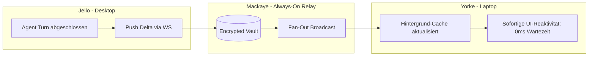

# Formale Spezifikation: Distributed Session Synchronization & Handoff Fabric (`dsh-mesh`)

## 1. Motivation und Zielsetzung

In verteilten Entwickler-Umgebungen (z. B. Desktop-Workstation `jello`, Laptop `yorke`, VPS-Server `mackaye` und `rollins`) ist die Kontinuität von AI-Agenten-Sitzungen eine fundamentale Anforderung:
- **Lokale Bindung aufbrechen**: Aktuell sind DSH-Sitzungen physisch an das lokale Dateisystem (`~/.dsh/sessions/<workspace-hash>/session-<id>/`) eines spezifischen Hosts gebunden.
- **Nahtloser Gerätewechsel (Seamless Handoff)**: Eine auf der Workstation (`jello`) begonnene architektonische Analyse oder Codierung soll im Zug oder auf dem Sofa auf dem Laptop (`yorke`) ohne Kontextverlust an exakt derselben Stelle fortgeführt werden können.
- **Akademische Korrektheit & Determinismus**: Keine unscharfen Heuristiken. Die Synchronisation muss mathematisch konsistent (Strict Serializability / Append-Only Event Sourcing), frei von Race Conditions und Split-Brain-Szenarien sein.
- **Zero-Leakage & Integrität**: Session-Daten, Werkzeugausgaben und Kontext-Spills bleiben strikt im gesicherten Tailscale-Mesh mit kryptografischer Authentifizierung.

---

## 2. Mathematische Formalisierung der Session & des Event-Logs

Eine DSH-Sitzung $\mathcal{S}$ ist als deterministischer Append-Only Stream von Ereignissen (Events) modelliert:

$$\mathcal{S} = \langle \mathcal{U}, \mathcal{W}, \mathcal{E}, \mathcal{L} \rangle$$

wobei:
1. **$\mathcal{U} = \text{SessionUUID} \in \{0,1\}^{128}$**: Global eindeutige, invariante Sitzungs-Identität.
2. **$\mathcal{W} \in \text{CanonicalWorkspace}$**: Portabler Arbeitsbereich-Bezeichner (entkoppelt vom lokalen Host-Dateipfad).
3. **$\mathcal{E} = [e_0, e_1, e_2, \dots, e_n]$**: Total geordnete Folge von Session-Events mit monoton steigendem Sequenzindex:
   $$e_i = \langle \text{seq} = i, \text{timestamp}, \text{type}, \text{payload}, \text{prevHash}, \text{hash} \rangle$$
4. **$\mathcal{L}$**: Exklusive Schreib-Lease (Distributed Write Token), die zu jedem Zeitpunkt $t$ an höchstens einen aktiven Node $\mathcal{N}$ vergeben ist:
   $$\mathcal{L}(t) = \langle \mathcal{N}_{\text{holder}}, \tau_{\text{expire}}, \nu_{\text{leaseEpoch}}, \sigma_{\text{signature}} \rangle$$

```mermaid
sequenceDiagram
    autonumber
    participant Y as Yorke (Laptop)
    participant J as Jello (Desktop)
    participant M as Mackaye (Optional Vault / Relay)

    Note over J: Jello hält aktive Lease L(epoch=1)
    Note over Y: Benutzer öffnet DSH auf Yorke
    Y->>J: DirectP2P: RequestLeaseHandoff(sessionId, target="yorke")
    
    alt Direkte P2P-Verbindung aktiv (beide online)
        Note over J: Jello flusht Puffer auf NVMe (seq=43)
        J->>Y: DirectP2P: TransferLease(epoch=2, lastSeq=43) + TailEvents([e_43])
        Note over Y: Yorke übernimmt Lease L(epoch=2), aktiviert UI
        par Asynchroner Vault-Update
            Y-->>M: PushDeltaAndLeaseState(epoch=2, seq=43)
        end
    else Jello im Suspend / offline (Store-and-Forward Fallback)
        Y->>M: QueryVaultState(sessionId)
        M-->>Y: ReturnLastKnownState(epoch=1, lastSeq=42, status="suspended")
        Note over Y: Lease auf Jello vor Suspend freigegeben;<br/>Yorke akquiriert sofort neue Lease L(epoch=2)
    end
```

---

## 3. Architektur der Synchronisations-Schicht

### 3.1 Topologie: Symmetrisches, echtes Peer-to-Peer (Gleichberechtigte Knoten)

Ein zentraler Architektur-Grundsatz: **Alle Knoten (`jello`, `yorke`, `mackaye`, `rollins`, `strummer`) sind gleichberechtigte Peers im Mesh.** Es gibt keinen privilegierten "Master-Server", der als Single Point of Failure oder Gatekeeper fungiert:

- **Direkte Peer-to-Peer Kommunikation (Direct Mesh)**:
  Befinden sich `jello` (Desktop) und `yorke` (Laptop) im selben Netzwerk oder via Tailscale online, sprechen sie **direkt P2P miteinander** (WebSocket/Typert RPC). Die Lease-Übergabe und der Delta-Transfer laufen direkt von Gerät zu Gerät in < 15ms ohne jeden Umweg.
- **Store-and-Forward / Rendezvous-Rolle (Opt-in)**:
  Ein immer erreichbarer Knoten (wie `mackaye` oder `rollins`) fungiert **nicht als autoritärer Master**, sondern lediglich als passives **Durable Rendezvous & Store-and-Forward Vault**:
  - Wenn `jello` heruntergefahren wird, während `yorke` offline ist, deponiert `jello` das verschlüsselte Delta auf einem beliebigen erreichbaren Mesh-Peer (z. B. `mackaye`).
  - Schaltet man `yorke` später ein, holt sich `yorke` das Delta ab.
  - Sind `jello` und `yorke` gleichzeitig online, können sie das Relay komplett ignorieren und rein P2P synchronisieren.
- **Leaderless Lease Consensus (Raft-Token / Dynamic Lease Handoff)**:
  Die Lease wandert dynamisch als kryptografisches Token von Peer zu Peer. Jeder Peer kann eine Lease direkt von ihrem aktuellen Inhaber anfordern oder bei Nichterreichbarkeit über ein dezentrales Quorum verifizieren.

```
                    ┌────────────────────────────────────────┐
                    │       SYMMETRISCHES P2P MESH           │
                    │         (Tailscale Enclave)            │
                    │                                        │
                    │    ┌──────────────────────────────┐    │
                    │    │            jello             │    │
                    │    │          (Desktop)           │    │
                    │    └──────▲────────────────▲──────┘    │
                    │           │                │           │
                    │    Direkt │ P2P     Direkt │ P2P       │
                    │    (15ms) │         (15ms) │           │
                    │           ▼                ▼           │
                    │    ┌──────────────┐  ┌───────────┐     │
                    │    │    yorke     │  │  mackaye  │     │
                    │    │   (Laptop)   │  │  (Vault)  │     │
                    │    └──────▲───────┘  └─────▲─────┘     │
                    │           │                │           │
                    │           └────────────────┘           │
                    │               Direkt P2P               │
```

---

## 4. Kern-Komponenten & Detailentwurf

### 4.1 Portable Workspace Identity ($\mathcal{W}$)

**Problem**: 
Auf `jello` liegt ein Repository unter `/home/philipp/dev/commpact-ui`. Auf einem VPS liegt es ggf. unter `/srv/git/commpact-ui` oder auf einem anderen Gerät unter `~/projects/commpact-ui`. Die lokale Hash-Generierung (`--home-philipp-dev-commpact-ui--`) führt zu inkompatiblen Session-Verzeichnissen.

**Kanonische Lösung**:
Einführung einer zweistufigen Workspace-URN:
1. **Git-Anchored Workspace**:
   $$\mathcal{W} = \text{urn:dsh:workspace:git:sha256}(\text{RemoteOriginURL}) \mathbin{\Vert} \text{relativeSubdir}$$
   Beispiel: `urn:dsh:workspace:git:github.com/fleischerdesign/nixfiles:commpact-ui`.
2. **Local Fallback Workspace**:
   Liegt kein Git-Repository vor, wird ein relativer Pfad zum User-Home als deterministischer Hash aufgelöst (`urn:dsh:workspace:relhome:dev/my-project`).

Beim Start von DSH auf einem Knoten $\mathcal{N}$ prüft das Mesh-Plugin den lokalen Workspace, berechnet dessen URN und verlinkt den Session-Pfad transparent:
`~/.dsh/workspaces/<workspace-urn-hash>/sessions/<session-id>/`.

---

### 4.2 Append-Only Delta Replikation & Content-Addressed Blobs

Das Upstream-Format von DSH speichert Events in Zstandard-komprimierten JSONL-Dateien (`session.v2.jsonl.zstd`).

1. **Monotone Sequence Validation**:
   - Jedes Event besitzt einen strikten Index $i = 0, 1, 2, \dots$.
   - Bei der Replikation sendet der anfordernde Knoten:
     $$\text{SyncRequest} = \langle \mathcal{U}, \text{sinceSeq} = k \rangle$$
   - Der sendende Knoten antwortet mit dem Delta-Slice $[e_{k+1}, \dots, e_m]$.
   - Lücken in der Sequenz ($e_{j} \to e_{j+2}$) führen zum sofortigen Abbruch (`SequenceGapException`) und erzwingen einen Full-Catchup.

2. **Content-Addressed Blobs (Attachments & Spills)**:
   - Tool-Ausgaben, die das In-Memory-Budget überschreiten (`dsh-spill-local`), sowie Bild-/PDF-Anhänge werden als externe Blobs mit SHA-256 Hash gespeichert:
     `~/.dsh/attachments/sha256/<hash>`.
   - Das Event-Log referenziert lediglich den Content-Hash $\mathcal{H}$.
   - Beim Einlesen eines Turns prüft der lokale Knoten, ob $\mathcal{H}$ im lokalen Blob-Store existiert. Fehlt der Blob, wird er lazy über den Typert RPC-Endpunkt `mesh.fetchBlob(hash)` vom Peer oder Relay nachgeladen.

3. **Live Token Streaming & Ephemeral State Replication (Während des Schreibens)**:
   - **Typing Indicator & Input Drafts:** Tippt der Benutzer im Composer auf `jello`, sendet der Node flüchtige Typing-Events (`SessionInputDraftEvent`) an verbundene Peers. Auf `yorke` sieht man in Echtzeit, dass auf `jello` getippt wird.
   - **Real-Time LLM Token Streaming:** Wenn das Modell antwortet, wartet DSH **nicht**, bis die gesamte Antwort fertig generiert ist. Die Tokens werden per WebSocket/SSE live als flüchtiger Stream (`token_chunk`) an alle zuschauenden Peers gebroadcastet. Auf `yorke` läuft der Text Buchstabe für Buchstabe mit, als säße man vor `jello`.
   - **In-Flight Tool Execution Indicator:** Führt der Agent gerade ein langlebiges Werkzeug aus (z. B. `dotnet build`), sehen alle Peers live das pulsierende Tool-Badge mit Laufzeit-Timer (`⏳ Tool "bash" running on jello...`).
   - Erst wenn der Turn abgeschlossen ist, wird das finale, persistente Event $e_i$ in die `.jsonl.zstd`-Datei geschrieben und dauerhaft synchronisiert.

---

### 4.3 Distributed Write Leases & Split-Brain-Schutz

Um korrupte Event-Logs bei paralleler Nutzung zu verhindern:

1. **Lease Invariant**:
   Zu jedem Zeitpunkt darf exakt **ein** Knoten Schreiboperationen (`writeEvent`, `appendTurn`, `executeTool`) auf der Session $\mathcal{S}$ ausführen. Alle anderen Knoten befinden sich im passiven Modus (`read-only` / `spectator`).

2. **Lease-Lebenszyklus**:
   - **Gültigkeit**: $\tau_{\text{lease}} = 30\,\text{s}$.
   - **P2P Heartbeat-Verlängerung**: Der aktive Lease-Inhaber erneuert alle $10\,\text{s}$ die Lease direkt mit den verbundenen Mesh-Peers bzw. spiegelt den Heartbeat asynchron an den erreichbaren Vault-Knoten (`mackaye`).
   - **Flock-Bindung**: Auf dem aktiven Knoten hält der Prozess den lokalen POSIX-Dateilock `session.lock` via `fs-ext`.
   - **Lease Expiration (Fail-Closed)**: Reißt die Netzwerkverbindung ab und kann die Lease nach Ablauf von $\tau_{\text{lease}}$ nicht validiert werden, schützt sich der lokale Knoten selbst und wechselt in den Zustand `Lease Expired (Read-Only)`. Laufende LLM-Generierungen werden deterministisch angehalten.

3. **Direkter P2P Handoff-Handshake (Graceful Transfer)**:
   - Benutzer klickt auf `yorke` auf *"Continue Session here"* (oder tippt im Composer):
   - **Fall 1 (Beide Rechner online - Direkt P2P):**
     - `yorke` sendet direkt via Typert RPC `RequestLeaseHandoff(sessionId, target="yorke")` an `jello`.
     - `jello` beendet den aktuellen Streaming-Chunk, flusht den Puffer auf NVMe, gibt den lokalen `session.lock` frei und antwortet mit `HandoffReady(lastSeq, epoch=epoch+1)`.
     - `yorke` übernimmt die Lease direkt ohne Umweg in $< 15\,\text{ms}$ und pusht den neuen Epoch-Stand asynchron an den Vault.
   - **Fall 2 (Jello im Suspend / offline - Store-and-Forward Fallback):**
     - `yorke` fragt das Vault-Rendezvous auf `mackaye` an.
     - Da `jello` vor dem Suspend via `systemd-sleep`-Hook die Lease freigegeben hat, quittiert der Vault die Freigabe und `yorke` übernimmt die Lease sofort.

---

### 4.4 Resilienz bei Offline-Arbeit & Partitionen

| Szenario | Auswirkung | Formale Resilienz-Strategie |
|---|---|---|
| **Laptop (`yorke`) unterwegs ohne Internet** | Kein Kontakt zum Lease-Koordinator (`mackaye`). | **Offline Forking**: Der Benutzer kann auf dem Laptop weiterarbeiten. Da die zentrale Lease nicht verifiziert werden kann, forkt DSH die Session deterministisch: $\mathcal{U}_{\text{fork}} = \text{sha256}(\mathcal{U} \mathbin{\Vert} \text{nodeId} \mathbin{\Vert} t)$. Die ursprüngliche Session bleibt unberührt. Später kann ein 3-Way Conversation Merge oder Side-by-Side Review im UI erfolgen. |
| **Plötzlicher Absturz von `jello` (Kernel Panic / Stromausfall)** | Lease ist verwaist, `jello` kann kein `ReleaseLease` senden. | **Lease Expiry Watchdog**: Nach Ablauf des TTL ($\tau_{\text{lease}} = 30\,\text{s}$) deklariert der Koordinator die Lease als `abandoned`. `yorke` kann die Lease nach Ablauf der Grace-Period (45s) gefahrlos übernehmen. Die letzte bekannte Sequenznummer auf dem Relay bildet den Ausgangspunkt. |
| **Gleichzeitiges Tippen auf zwei Geräten** | Race Condition beim Senden eines Prompts. | **Epoch Gating**: Jeder `append`-Aufruf muss die aktuelle $\nu_{\text{leaseEpoch}}$ übermitteln. Stimmt die Epoche nicht mit dem aktuellen Koordinator-State überein, wird der Request mit `StaleLeaseEpochError` abgewiesen. |
| **Lokale Pfad-Unterschiede bei Tool-Execution** | Ein Bash-Kommando enthält `/home/philipp/...`. | **Virtual Environment Variable Anchoring**: In DSH generierte Pfade in Tool-Inputs werden mit `$WORKSPACE_ROOT` parametriziert. Beim Node-Wechsel bindet das lokale Plugin `$WORKSPACE_ROOT` an den realen lokalen Checkout-Pfad des Zielrechners. |

---

## 5. Performance & Local-First Reactive Engine (Sub-50ms Latency)

Um zu garantieren, dass der Benutzer beim Wechsel des Endgeräts (z. B. beim Aufklappen von `yorke`) **ohne jegliche spürbare Verzögerung (< 50ms)** sofort tippen und weiterarbeiten kann, nutzt `dsh-mesh` ein striktes **Local-First & Proactive Push-Modell**:



### 5.1 Proaktive Replikation im Hintergrund
- **Kein Pull-on-Demand beim Öffnen**: Sobald ein Gerät online ist, empfängt ein schlanker Daemon (`dsh-mesh`) über Tailscale WebSocket-Pushes aller neuen Events.
- **Cache-Zustand**: Beim Öffnen der UI sind 99% aller vergangenen Turns bereits lokal im NVMe-Cache vorhanden. Das Rendern des Chats erfolgt mit **0 ms Netzwerk-Latenz**.

### 5.2 Tiered Asset Loading (Lazy Blob Streaming)
- **Tier 1 (Instant):** Message-Events, Rollen, Text-Tokens, Tool-Metadaten. Diese wiegen pro Turn nur wenige Kilobytes und werden synchron im Memory-Store gehalten.
- **Tier 2 (Lazy on-demand):** Große Werkzeug-Spills (> 100 KB), Terminal-Dumps und generierte Bild-/PDF-Anhänge verbleiben als Content-Hash im Event. Sie werden erst asynchron über den Mesh-Peer oder das VPS-Relay gestreamt, wenn der Benutzer das betreffende Tool-Ergebnis in der UI explizit aufklappt.

---

## 6. Git-State-Drift & Shadow Worktree Synchronization

Ein kritisches Praxis-Problem beim Gerätewechsel: Der Chatverlauf ist synchron, aber der Quellcode auf der Festplatte ist auf unterschiedlichen Ständen (z. B. uncommitted Changes auf `jello`, die noch nicht gepusht wurden).

### 6.1 State Fingerprinting im Event-Log
Jeder Turn protokolliert den exakten Zustand des Quellcode-Repositories:
$$\text{CodeAnchor} = \langle \text{commitHash}, \text{branch}, \text{isDirty}, \text{diffHash} \rangle$$

### 6.2 Deterministische Handoff-Strategien bei uncommitted Changes oder fehlendem Workspace
Stellt `yorke` beim Öffnen der Session fest, dass der lokale Git-Zustand abweicht oder der Workspace auf `yorke` gar nicht lokal existiert, agiert das System **niemals heimlich**, sondern bietet dem Benutzer im UI drei explizite Optionen via **Workspace Action Banner**:

```
┌──────────────────────────────────────────────────────────────────────────────────┐
│ 📍 Projekt existiert auf "jello" (/home/philipp/dev/commpact-ui)                 │
│    Status auf diesem Gerät ("yorke"): Nicht ausgecheckt / lokaler Drift.         │
│                                                                                  │
│   [ 🚀 Remote auf Jello (Alt+R) ]  [ 📥 Hierher synchronisieren ]  [ 💬 Nur Chatten ] │
└──────────────────────────────────────────────────────────────────────────────────┘
```

1. **Option A: Remote Execution via Jello (`Alt+R`)**:
   - Die DSH-UI läuft auf `yorke`, alle Werkzeugaufrufe (`bash`, `write_to_file`, `lsp`) werden jedoch mit sichtbarem Badge `[via jello]` per OCAP-Delegation über Tailscale direkt auf `jello` ausgeführt.
   - **Edge Case: Jello schläft ein / Netzwerk bricht ab:**
     Bricht während eines Remote-Calls die Verbindung ab, wechselt DSH in den Zustand `Remote Node Unreachable`. Der laufende Turn wird sauber mit `RemoteNetworkError` angehalten; es gibt keine hängenden Prozesse.
2. **Option B: Workspace Clonen & Patch anwenden**:
   - `dsh-mesh` stößt im Hintergrund `git clone` an und überträgt den flüchtigen Patch (`git diff HEAD`) von `jello`.
   - **Edge Case: Merge-Konflikt beim Patch-Anwenden:**
     Schlägt `git apply` auf `yorke` fehl (weil dort bereits manuelle Änderungen vorlagen), verwirft DSH nichts. Stattdessen wird der Patch als `.dsh/patches/incoming-<ts>.patch` abgelegt und das UI schlägt automatisch den Wechsel zu *Option A (Remote auf Jello)* vor, bis der Konflikt gelöst ist.
3. **Option C: Reiner Planungs- & Diskussions-Modus (Chat Only)**:
   - Alle dateisystem-mutierenden Tools werden stummgeschaltet. Der Agent agiert rein beratend auf Basis des synchronisierten Chat-Kontexts.

---

## 7. Zero-Knowledge Envelope Encryption (Datenschutz am Relay)

Da ein Relay (`mackaye`/`rollins`) als 24/7 erreichbarer Zwischenspeicher fungieren kann, muss sichergestellt sein, dass Chats und Code-Inhalte auf dem Server zu jedem Zeitpunkt kryptografisch geschützt sind:

1. **Symmetrischer Session-Schlüssel ($K_{\mathcal{S}}$)**:
   - Beim Erstellen einer neuen Sitzung wird lokal ein $256\text{-Bit}$ AES-GCM Schlüssel generiert.
2. **Envelope Asymmetric Wrap**:
   - $K_{\mathcal{S}}$ wird mit den öffentlichen Age-Keys aller autorisierten Endgeräte des Benutzers verschlüsselt (`jello`, `yorke`):
     $$E_{\text{key}} = \langle \text{AgeEncrypt}(K_{\mathcal{S}}, \text{Key}_{\text{jello}}), \text{AgeEncrypt}(K_{\mathcal{S}}, \text{Key}_{\text{yorke}}) \rangle$$
3. **Zero-Knowledge Relay Guarantee**:
   - Das Relay empfängt und speichert ausschließlich das verschlüsselte Chiffrat:
     $$\mathcal{C}_{\text{payload}} = \text{AES-256-GCM}(K_{\mathcal{S}}, \text{rawJsonlBytes})$$
   - Das Relay sieht ausschließlich Metadaten ($\mathcal{U}$, $\text{seq}$, $\nu_{\text{leaseEpoch}}$), besitzt jedoch zu keinem Zeitpunkt den Klartext der Konversation.

---

## 8. UI/UX-Integration im DSH-Frontend

1. **Reaktive Session-Kopfleiste (Header)**:
   - Schnelle optische Statusanzeige mit Sub-100ms Umschaltung:
     - `🟢 Live (Local Lease: yorke)`
     - `🔗 Remote Mode (Backend: jello)`
     - `⚡ Active on Jello — [Claim Session (Enter)]`
     - `🔵 Offline Mode (Local Branch)`
2. **Workspace Action Banner**:
   - Erscheint dezent über dem Composer, sobald lokaler Pfad und Session-Herkunft divergieren. Ermöglicht sofortiges Umschalten zwischen Remote-Execution, Clonen oder Chat-Only.
3. **Turn-Attribution**:
   - Jeder Assistenten-Turn und jeder Tool-Aufruf zeigt transparent an, wo er ausgeführt wurde:
     - `🔧 bash (executed on jello)` vs. `🔧 bash (executed locally on yorke)`.
4. **Zero-Friction Prompt Submission**:
   - Ist der Workspace synchron, wird die Lease beim Tippen und Drücken von Enter im selben Call geräuschlos übernommen. Bei Divergenzen fragt das Action-Banner vorher nach der Präferenz.

---

---

## 9. OS-, Hardware- und Browser-Lebenszyklus-Integration

Für lückenlose Zuverlässigkeit im Alltag müssen physische Betriebssystem- und Hardware-Ereignisse deterministisch verarbeitet werden:

### 9.1 Laptop-Deckel zu / Suspend-to-RAM (`systemd-sleep`)
- **Problem:** Klappt der Benutzer das Notebook zu, reißt die TCP/WireGuard-Verbindung lautlos ab (Silent Half-Open Socket). Ein entfernter Peer müsste $30\,\text{s}$ auf den Heartbeat-Timeout warten.
- **Deterministische Lösung:**
  - Einbindung in NixOS via `powerManagement.powerDownCommands`:
  - Vor dem Suspend sendet das System ein Signal (`SIGUSR1`) an den lokalen DSH-Daemon.
  - DSH flusht alle ungeschriebenen Events auf Disk und sendet in $< 10\,\text{ms}$ ein explizites `ReleaseLease(immediate=true)` an alle Mesh-Peers.
  - Setzt sich der Benutzer an die Workstation `jello`, ist die Session **sofort mit 0s Wartezeit** freigegeben.

### 9.2 POSIX-File-Locking & Cordis-Pipeline Harmonisierung
- **Problem:** DSH nutzt lokal `flock` auf `session.lock` (`fs-ext`). Schreibt ein externer Daemon in dieselbe Datei, drohen Lock-Deadlocks.
- **Lösung:**
  - Das Mesh-Synchronisationsmodul läuft **als nativer Cordis-Service** direkt innerhalb des DSH-Laufzeitprozesses und nutzt dieselbe `ctx.sessionPersistence`-Instanz.
  - Externe Dateisystem-Konflikte sind dadurch architektonisch ausgeschlossen.

### 9.3 Multi-Tab Browser-Koordination
- **Problem:** Auf einem Gerät sind mehrere Browser-Tabs mit DSH geöffnet; Tabs könnten gegeneinander um die Lease konkurrieren.
- **Lösung:**
  - Koordination im Frontend über die Web `BroadcastChannel`-API. Nur der jeweils fokussierte Tab hält die aktive UI-Präsenz.

### 9.4 Subagenten- und Long-Running-Task-Kontinuität
- **Problem:** Ein auf `jello` gestarteter Hintergrund-Task oder Subagent läuft noch, während der Benutzer die Session auf `yorke` übernimmt.
- **Lösung:**
  - Die Lease bindet die gesamte Session-Familie (Root-Session + Subagenten).
  - Der Subagent läuft auf `jello` ungestört im Hintergrund zu Ende (Detached Worker). Seine Resultate werden nach Abschluss als Event `SubagentExecutionCompleted` ins Mesh gepusht und erscheinen auf `yorke` nahtlos im Chatverlauf.

---

## 10. Implementierungs-Roadmap & Modul-Struktur

1. **Phase 1: Symmetric P2P Discovery & Read-Only Catalog (`dsh-mesh`)**:
   - Gossip und direkte Typert-RPC Discovery aller bekannten Sessions zwischen allen Peers im Tailscale-Mesh.
   - Remote-Anzeige im Frontend mit Host-Badge (`💻 jello`, `💻 yorke`, `🌐 mackaye`).
2. **Phase 2: Proaktiver Delta-Sync & Lazy Blob Streaming**:
   - P2P WebSocket-Push von Event-Deltas zwischen online Peers mit optionalem Store-and-Forward Rendezvous auf VPS.
   - Content-Addressed Blob Streamer für große Tool-Spills und Attachments.
3. **Phase 3: Symmetrischer Lease Token Transfer & Zero-Friction Handoff**:
   - Peer-to-Peer Lease Übergabe beim Tippen im Composer.
   - Zero-Knowledge Envelope Encryption (Age-basiert) für Store-and-Forward Nodes.
4. **Phase 4: Git-State Drift & Shadow Worktrees**:
   - Automatisierter `git diff` Transfer für dirty Workspaces zwischen Rechnern mit Remote-Execution Proxy-Fallback.
5. **Phase 5: Hardware Hooks & Suspend Integration**:
   - NixOS `powerManagement` Hook für sofortige Lease-Freigabe bei Suspend/Sleep.
