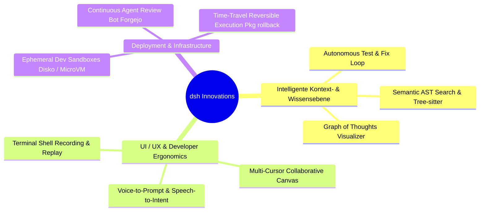

# Feature Ideation, Ergonomie-Innovationen und Future Roadmap

Dieses Dokument dient als zentrale Sammelstelle und architektonische Diskussionsgrundlage für zukünftige High-Value-Erweiterungen im DeepSeek Harness (`dsh`). Ziel ist es, innovative Ideen aus modernen Entwicklerumgebungen (Cursor, Claude Code Desktop, Windsurf, Devin, Zed, Neovim) mit der formalen NixOS- und Multi-Tenant-Architektur von `dsh` zu verschmelzen.

---

## Übersicht der Feature-Kandidaten

---

## 1. Autonomous Test & Fix Loop (`dsh-verify-loop`)

### Motivation & Konzept
Wenn ein Agent Code generiert, scheitert er oft nicht am Verständnis der Aufgabe, sondern am Fehlen einer unmittelbaren Rückkopplungsschleife. Anstatt dass der Entwickler Compiler-Fehler manuell zurück in den Chat kopieren muss, orchestriert `dsh-verify-loop` eine automatisierte Verifikations-Kaskade.

### Funktionsweise
1. Nach jeder Datei-Mutation führt das System im Hintergrund die passende Test-Suite aus (z. B. `cargo test`, `npm test`, `nix flake check`, `pytest`).
2. Schlägt der Build oder ein Test fehl:
   - Die Fehlermeldung wird strukturiert erfasst (Exit-Code, Stacktrace, fehlschlagende Assertion).
   - Ein interner Sub-Turn wird gestartet: *"Test `test_auth_token_expiry` schlug mit Zeile 104 fehl. Analysiere und korrigiere den Code."*
   - Der Agent iteriert bis zu $N$ Versuchen (konfigurierbar) autonom, bevor er das Ergebnis an den Benutzer übergibt.
3. Im UI erscheint ein kompaktes Status-Badge: `[🔄 Auto-Fix Iteration 2/3: npm test passing ✓]`.

---

## 2. Ephemeral Dev Sandboxes & MicroVMs (`dsh-sandbox`)

### Motivation & Konzept
Agenten mit `exec_shell`-Berechtigungen stellen ein Sicherheitsrisiko für das Host-System dar (Versehentliches Löschen von Pfaden, Secret-Exfiltration). Eine lokale Sandbox mit KVM/MicroVM (z. B. via NixOS `nixos-rebuild build-vm` oder MicroVM.nix / Firecracker) isoliert die Ausführung vollständig.

### Funktionsweise
- Für jede Session wird ein flüchtiger, isolierter MicroVM- oder Bubblewrap-Container instanziiert.
- Das Projektverzeichnis wird als Copy-on-Write Overlay gemountet.
- Der Agent kann beliebige zerstörerische Befehle (`rm -rf`, Netzwerk-Tests, Root-Privilegien) ausführen, ohne das Host-Dateisystem zu gefährden.
- Nach Abschluss der Session wird die Sandbox verworfen; nur die explizit genehmigten Diffs fließen in das Host-Repository zurück.

---

## 3. Semantic AST Search & Tree-sitter Navigation (`dsh-ast-nav`)

### Motivation & Konzept
Reine Vektor-Embeddings oder Text-Grep sind oft ungenau für die Code-Navigation (z. B. Übersehen von Vererbungen oder Verwechseln von Variablennamen mit Strings).

### Funktionsweise
- Integration von Tree-sitter direkt in den DSH-Indexierer.
- Ermöglicht strukturierte Code-Queries:
  - *"Finde alle Funktionen, die `UserIdentity` als Parameter annehmen."*
  - *"Zeige alle NixOS-Optionen, die den Typ `lib.types.submodule` haben."*
- Der Agent kann vor dem Refactoring exakte Abhängigkeitsgraphen auf Funktions- und Modulebene abfragen.

---

## 4. Time-Travel Session Branching & Git History Graph (`dsh-branching`)

### Motivation & Konzept
Oft begibt sich ein Agent bei komplexen Problemen in eine Sackgasse. Aktuell muss der Benutzer die Session abbrechen oder die Konversation manuell zurückscrollen.

### Funktionsweise
- Jede Chat-Nachricht und jedes Werkzeug-Ergebnis ist ein Knoten in einem gerichteten azyklischen Graphen (DAG).
- Der Benutzer kann an **jedem Punkt der Historie** einen neuen Zweig abspalten (`Fork Session from Turn 14`).
- Im UI wird der Konversationsbaum visuell als U-Bahn-Netzplan dargestellt. So können alternative Lösungsansätze für dieselbe Aufgabe parallel verglichen werden.

---

## 5. Forgejo / Git Webhook Agent Automation (`dsh-ci-bot`)

### Motivation & Konzept
DSH läuft als dauerhafter Dienst auf `mackaye` oder `rollins`. Warum soll er nur auf manuelle Chat-Eingaben reagieren?

### Funktionsweise
- Registrierung von Webhook-Endpunkten in Forgejo/GitHub über `dsh-ingress`.
- Bei einem neuen Pull-Request oder Issue:
  1. DSH erzeugt automatisch eine isolierte Session.
  2. Führt Code-Review, Sicherheitsprüfungen und Linting (`statix`, `deadnix`) durch.
  3. Postet konstruktive Review-Kommentare oder schlägt direkt einen Fix-Branch vor.

---

## 6. Voice-to-Intent & Voice Interaction (`dsh-voice`)

### Motivation & Konzept
Beim Pair-Programming tippt man oft ungern lange Erklärungen in eine Chatzeile, wenn man gerade mit den Händen im Code vertieft ist.

### Funktionsweise
- Lokale Whisper-Integration (z. B. via `whisper.cpp` oder Faster-Whisper auf dem Desktop `jello`).
- Floating Push-to-Talk Button im DSH-Composer.
- Lokale Transkription mit automatischer Markdown-Formatierung und Entity-Erkennung (Code-Tokens, Dateinamen).

---

## Priorisierungs- und Bewertungsmatrix

| Feature | Komplexität | Mehrwert / Impact | Architektonische Vorbedingungen |
|---|---|---|---|
| **Autonomous Test & Fix Loop** | Mittel | Extrem Hoch | DSH Execution Context, Tool Event Feedback |
| **Ephemeral Sandboxes (Bubblewrap/MicroVM)** | Hoch | Sehr Hoch | NixOS System-Konfiguration, Cgroups / KVM |
| **AST Tree-sitter Navigation** | Mittel | Hoch | Tree-sitter Bindings, AST Parser Daemon |
| **Time-Travel Session Branching** | Niedrig-Mittel | Hoch | Session Store Snapshotting |
| **Forgejo Webhook Review Bot** | Mittel | Hoch | `dsh-ingress` (bereits existent!), API-Tokens |
| **Voice-to-Intent (Whisper)** | Niedrig | Mittel | Lokales Whisper Modell, Web-Audio Stream |
