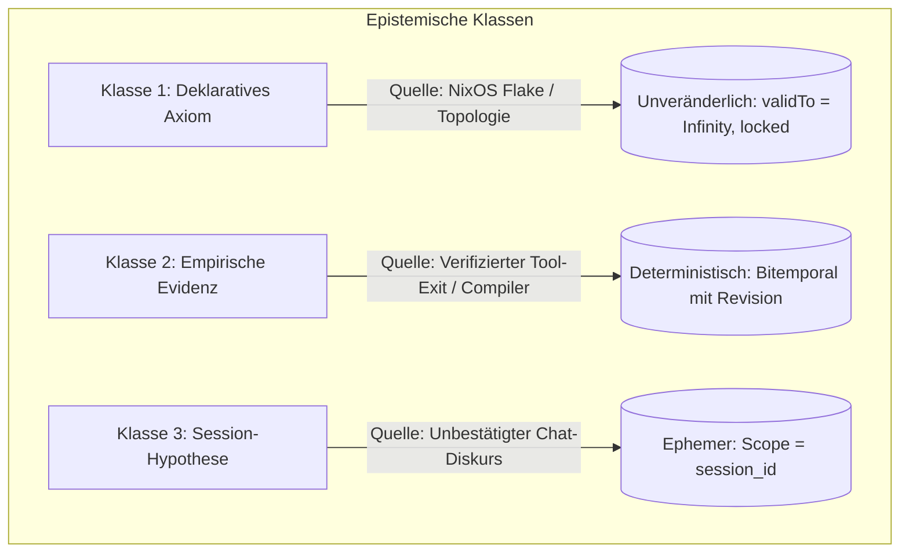

# Formale Spezifikation: Memory Reliability, Epistemische Lebenszyklen und Edge-Case-Resilienz (`dsh-memory`)

## 1. Ergonomie- und Zuverlässigkeitsphilosophie

In autonomen und semi-autonomen Agenten-Systemen ist das Gedächtnis das sensibelste Subsystem:
- **Ein vergessener Fakt** (False Negative) führt zu redundanter Arbeit, Fehlkonfigurationen und Frustration.
- **Ein falsch klassifizierter oder halluzinierter Fakt** (False Positive) korrumpiert nachfolgende Entscheidungen dauerhaft.
- **Unkontrollierte Kontext-Injektion** sprengt das Token-Budget, erhöht Latenz und Kosten und führt zu sogenanntem "Lost in the Middle"-Kontextverfall beim LLM.

Die formale Architektur von `dsh-memory` verbietet daher heuristisches Raten (z. B. Keyword-Regexes auf Chat-Nachrichten) und erzwingt stattdessen ein **streng epistemisches, evidenzbasiertes Lebenszyklus-Modell**.

---

## 2. Epistemische Wissensklassen & Lebenszyklen

Jeder Fakt $\mathcal{F} = \langle s, p, o, T_{\text{valid}}, T_{\text{tx}}, \tau, c, \mathbf{l}, \kappa \rangle$ gehört genau einer deterministischen epistemischen Klasse $\kappa \in \{\text{Axiom}, \text{Evidenz}, \text{Hypothese}\}$ an:



### 2.1 Klasse 1: Deklarative Axiome ($\kappa = \text{Axiom}$)
- **Herkunft:** Ausschließliche Ingestion aus deklarativer NixOS-Systemkonfiguration (`flake.nix`, `hosts/*/hardware-specific.nix`, SOPS-Templates).
- **Invariante:** $T_{\text{valid}} = [0, +\infty)$.
- **Mutationsschutz:** Weder ein LLM-Turn noch ein Benutzer über das UI oder die REST-API kann ein Axiom manipulieren, überschreiben oder mit einem TTL versehen.
- **Beispiele:** Host-Namen, Schnittstellen-Bindungen, statische IPs, CPU-Architekturen.

### 2.2 Klasse 2: Empirische Evidenz ($\kappa = \text{Evidenz}$)
- **Herkunft:** Entsteht **ausschließlich durch erfolgreiche Tool-Ausführungen** mit kryptografisch oder logisch verifizierbarem Resultat:
  - Dateisystem-Schreibvorgang erfolgreich abgeschlossen $\implies \text{FileContentHash}(path) = hash$.
  - Compiler / Linter erfolgreich durchgelaufen $\implies \text{LinterStatus}(path) = \text{clean}$.
  - Systemd-Unit aktiv $\implies \text{UnitState}(service) = \text{running}$.
- **Invariante:** Gültig ab dem Zeitpunkt der Messung ($validFrom = t_{\text{exec}}$).
- **Belief Revision:** Wird eine neue Messung durchgeführt, die dem alten Wert widerspricht, wird die alte Evidenz nicht gelöscht, sondern bitemporal abgeschlossen ($validTo = t_{\text{new}}$).

### 2.3 Klasse 3: Session-Hypothesen ($\kappa = \text{Hypothese}$)
- **Herkunft:** Flüchtiger Gesprächsverlauf, Zwischenüberlegungen des Agenten, unbestätigte Annahmen.
- **Invariante:** Strikt an den Gültigkeitsbereich der jeweiligen Sitzung gebunden (`scope_type = "session"`, `scope_id = sessionId`).
- **Promotion-Regel:** Eine Hypothese wird **niemals automatisch** zum globalen Fakt befördert. Sie kann nur durch explizite Benutzerbestätigung im Settings-Explorer oder durch erfolgreiche Tool-Verifikation zu einer Evidenz der Klasse 2 transformiert werden.

---

## 3. Exhaustive Edge-Case- & Szenarien-Matrix

| Szenario / Edge Case | Risiko | Erkennung | Mathematisch saubere Lösung |
|---|---|---|---|
| **1. Frühe / Falsche Eviction (TTL-Verfall)** | Ein wichtiger Fakt (z. B. ein benutzerdefiniertes Port-Mapping) verschwindet nach 24h, weil fälschlicherweise ein TTL gesetzt wurde. | Audit-Prüfung bei Speicherung: Axiome und empirische Evidenzen dürfen kein endliches TTL besitzen. | **Strict TTL Invariant:** $ttlSeconds$ ist ausschließlich für flüchtige Caches und Heartbeats zulässig. Versucht ein Tool, ein TTL auf Klasse 1 oder 2 zu setzen, wird der TTL-Parameter deterministisch auf `null` ($+\infty$) erzwungen. |
| **2. Homonym- & Entitäts-Kollision** | Zwei Services auf unterschiedlichen Hosts oder in unterschiedlichen Projekten nutzen denselben Bezeichner (z. B. Port 9090 für Prometheus auf `mackaye` vs. Cockpit auf `jello`). | Validierung des Subject-URI schemas beim Ingest. | **Strenge URN-Hierarchie:** Subject-Strings wie `"prometheus"` oder `"port"` sind unzulässig. Erzwungene kanonische URIs: `urn:dsh:host:<host>:svc:<service>`. Unvollständig qualifizierte Subjects werden mit `InvalidSubjectUriException` abgewiesen. |
| **3. Reversibility & Rollback (AGM-Postulat)** | Ein Git-Zweig oder ein Rollout wird zurückgerollt (`git checkout` oder `nixos-rebuild rollback`). Die Wissensdatenbank behält aber die Fakten des verworfenen Zustands. | Worktree-State-Hash Drift zwischen Workspace und Memory-Graph. | **State-Coupled Invalidation:** Fakten, die an ein Projekt gebunden sind (`scope_type = "repo"`), tragen den Git-Commit-Hash als Validitätsanker. Wechselt der Commit-Hash auf einen historischen Stand, werden Fakten mit jüngerem Commit automatisch inaktiviert. |
| **4. Multi-Tenant Scope Leakage** | Ein User hinterlegt ein privates Token oder eine vertrauliche Notiz; durch fehlerhaftes Scoping gelangt es in den System-Prompt eines anderen Nutzers. | Information Flow Tracking im Datalog-Solver. | **Bell-LaPadula Join Constraint:** Ein Fakt mit `scope_type = 'user'` und `scope_id = 'user:alice'` wird im SQLite-Planer durch einen unumgehbaren Mandanten-Filter (`WHERE scope_id IN (?)`) isoliert. Ein Fallback auf `public` ist softwareseitig unmöglich. |
| **5. Token-Verschwendung bei Smalltalk** | User schreibt: *"Moin, alles gut bei dir?"* – Das System durchsucht die DB, findet irrelevante Treffer (z.B. "gut", "dir") und injiziert 400 Tokens. | BM25 Score & Query-Entropy Analyse. | **Zweistufiger Token-Guard:**<br>1. **Entropy Gate:** Prompts $< 3$ inhaltstragenden Wörtern triggern gar keinen DB-Recall.<br>2. **Relevance Threshold ($\theta$):** Nur Fakten mit $\text{BM25}(Q) \ge 3.5$ qualifizieren sich.<br>3. **Hard Token Budget:** Maximal 150 Tokens für Memory im Prompt. |
| **6. Zirkuläre Widersprüche (Oszillation)** | Agent speichert $A \implies B$, ein anderer Agent speichert $A \implies \neg B$ mit identischer Konfidenz in einer Schleife. | Erkennung wiederholter bitemporaler Superseding-Zyklen innerhalb von $< 60$ Sekunden. | **Dispute Freeze:** Erkennt die Engine mehr als 2 Oszillationen für dasselbe Tripel $(s, p)$, wechselt der Status des Fakts automatisch auf `'disputed'`. Beide Versionen werden markiert und der Agent wird im nächsten Turn zur Klärung aufgefordert, anstatt blind zu überschreiben. |

---

## 4. Deterministischer Token-Schutz-Algorithmus (Context Recall Gate)

Vor jeder Weiterleitung einer Benutzeranfrage an das Sprachmodell durchläuft der Prompt den folgenden formalen Filter:

```
Funktion EvaluateMemoryContext(Query Q, Tenant T, MaxTokens = 150, Threshold = 3.5):
  1. Extrahiere substantielle Signalwörter W = TokenizeAndFilterStopwords(Q)
  2. WENN |W| < 2 DANN:
       GIB LEEREN KONTEXT ZURÜCK (Tokenverbrauch: 0)

  3. Führe BM25 FTS5 Query auf SQLite aus unter Beachtung von Tenant T:
       Candidates = QueryFTS5(W, T)

  4. RelevanteFakten = []
  5. AkkumulierteTokens = 0

  6. FÜR JEDEN Fakt F IN Candidates SORTIERT NACH Rank DESC:
       WENN F.BM25Score < Threshold DANN:
         STOPPE SCHLEIFE (Relevanzgrenze erreicht)

       WENN F bereits im Chat-Verlauf der letzten 3 Turns vorkommt DANN:
         ÜBERSPRINGE F (Deduplizierung)

       FaktTokens = BerechneTokens(F)
       WENN AkkumulierteTokens + FaktTokens > MaxTokens DANN:
         STOPPE SCHLEIFE (Budget-Cap erreicht)

       Füge F zu RelevanteFakten hinzu
       AkkumulierteTokens += FaktTokens

  7. GIB FormatierteMemorySection(RelevanteFakten) ZURÜCK
```

### Garantien des Algorithmus:
- **Zero-Token-Garantie bei unrelevanten Anfragen:** Triviale Konversationen verbrauchen exakt **0 zusätzliche Tokens**.
- **Keine Wiederholungen:** Kein Aufblähen des Kontexts durch Fakten, die ohnehin unmittelbar zuvor im Chat erwähnt wurden.
- **Strikte Budget-Obergrenze:** Unabhängig von der Größe der Wissensdatenbank fließen niemals mehr als `MaxTokens` (Default 150) in das Context-Window.

---

## 5. UI/UX: Der Human-in-the-Loop Memory Governance Explorer

Im Settings-Dialog (`settings.section` $\to$ `knowledge`) wird die epistemische Transparenz für den Benutzer vollständig visualisiert:

1. **Badge-Codierung nach epistemischer Klasse:**
   - Blaues Schild 🛡️: `Klasse 1: Axiom` (Gesperrt, deklarativ via NixOS).
   - Grüner Haken ✓: `Klasse 2: Evidenz` (Verifiziert durch Werkzeug, mit Revisionshistorie).
   - Gelbes Notizblatt 📝: `Klasse 3: Hypothese` (Sitzungsspezifisch, editierbar).
2. **One-Click Invalidation:**
   - Benutzer können veraltete oder fehlerhafte Fakten mit einem Klick bitemporal widerrufen (`retractFact`).
3. **Bitemporale Historie:**
   - Klick auf einen Fakt zeigt die Historie: Wann wurde er erfasst, durch welches Tool/Nutzer, und welche vorherige Version hat er abgelöst.
