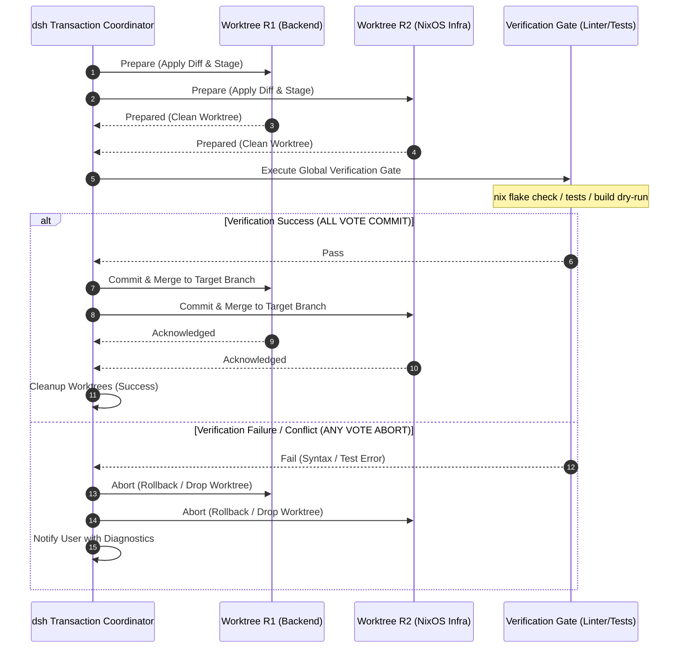

# Cross-Repository Semantic Graph Synthesis & Multi-Repo Two-Phase Commit

Diese Spezifikation beschreibt die theoretische und funktionale Modellierung von **Cross-Repository Semantic Graph Synthesis (CRSGS)** sowie die atomare Synchronisation via **Multi-Repo Two-Phase Commit (MR-2PC)** für autonome Entwickler-Agenten in `dsh`.

---

## 1. Problemstellung & Motivation

Moderne Software-Ökosysteme sind stark modularisiert: NixOS-Systemkonfigurationen (`/etc/nixos`), Microservices, Shared Libraries, Frontend-Repositories und Daten-Schemas sind physisch auf getrennte Git-Repositories aufgeteilt.

Existierende Coding-Agenten operieren fast ausschließlich auf der Abstraktionsebene eines **einzelnen Workspace-Roots** ($W \subset \text{Path}$). Versucht ein Agent, repo-übergreifend zu wirken, treten fundamentale Probleme auf:

1. **Context Fragmentation (Graph-Diskontinuität):** Schnittstellenverträge (z. B. ein geändertes API-Schema in Repo $A$) werden in abhängigen Repos ($B, C$) erst zur Laufzeit oder via CI erkannt.
2. **Atomic Inconsistency (Split-Brain Commits):** Modifiziert ein Agent Code in Repo $A$ und Repo $B$, führen partielle Commits/Pushes (z. B. Erfolg in $A$, Hook-Fehlschlag in $B$) zu einem inkonsistenten Gesamtzustand.
3. **Dirty-State Contamination:** Existieren im Arbeitsverzeichnis lokale Änderungen des menschlichen Entwicklers, darf der Agent weder fremden Code überschreiben noch unfertige Stashes in fremde Repos committen.

`dsh` löst dies durch eine mathematisch fundierte Multigraph-Synthese und einen gekapselten Transaktionsmanager.

---

## 2. Formale Definition: Cross-Repository Semantic Graph (CRSG)

Ein Cross-Repository Semantik-Graph ist ein gerichteter, typisierter Multigraph:

$$\mathcal{G} = \langle \mathcal{V}, \mathcal{E}, \tau_V, \tau_E, \omega \rangle$$

### 2.1 Knotenmenge $\mathcal{V}$ und Typisierung $\tau_V$
Jeder Knoten $v \in \mathcal{V}$ besitzt einen Typ $\tau_V(v) \in \mathcal{T}_V$:

$$\mathcal{T}_V = \{ \text{Repository}, \text{Module}, \text{Symbol}, \text{Interface}, \text{Endpoint}, \text{Contract} \}$$

- **Repository ($v_{\text{repo}}$):** Wurzelknoten einer Git-Boundary ($\text{RootPath}, \text{HeadCommit}, \text{OriginURL}$).
- **Module ($v_{\text{mod}}$):** Datei oder logischer Namensraum (z. B. `nix`-Datei, `ts`-Datei, `py`-Modul).
- **Symbol ($v_{\text{sym}}$):** Funktion, Typ, Klasse, Option (z. B. NixOS-Option `my.features.services.forgejo.enable`).
- **Endpoint ($v_{\text{end}}$):** Netzwerk- oder IPC-Schnittstelle (z. B. Caddy Reverse-Proxy, Tailscale IP, Socket, Port).
- **Contract ($v_{\text{con}}$):** Spezifikation (OpenAPI Spec, Protobuf, JSON-Schema, NixOS Assertion).

### 2.2 Kantenmenge $\mathcal{E}$ und Typisierung $\tau_E$
Jede Kante $e = (u, v) \in \mathcal{E}$ verbindet Entitäten über oder innerhalb von Repository-Grenzen:

$$\tau_E(e) \in \{ \text{imports}, \text{implements}, \text{invokes}, \text{binds\_port}, \text{tracks\_flakeref}, \text{exposes\_schema} \}$$

Beispiele:
- $(v_{\text{nixos\_cfg}}, v_{\text{forgejo\_repo}}) \xrightarrow{\text{tracks\_flakeref}} \text{Flake Input URL}$
- $(v_{\text{frontend\_api}}, v_{\text{backend\_route}}) \xrightarrow{\text{invokes}} \text{HTTP REST Call}$
- $(v_{\text{service\_feature}}, v_{\text{caddy\_endpoint}}) \xrightarrow{\text{binds\_port}} \text{TCP 3000}$

### 2.3 Kantengewichte $\omega: \mathcal{E} \to (0, 1]$
Das Kantengewicht repräsentiert die semantische Kopplungsstärke:
- $\omega = 1.0$: Statische, synchrone Typ-Bindung (z. B. Nix-Import, direkter Funktionsaufruf).
- $\omega = 0.7$: Dynamische Dienst-Bindung (z. B. Caddy Reverse-Proxy zu lokalem Port).
- $\omega = 0.3$: Lockere Benennungs-/Tag-Kopplung (z. B. Log-Labels, Kommentar-Referenzen).

---

## 3. Disziplinierte Graph-Synthese (Agnostische Discovery)

Die Discovery von Repositories erfolgt deterministisch und sicherheitsorientiert nach dem **Principle of Least Privilege (PoLP)**.

```
+-------------------------------------------------------------------------+
|                      dsh Graph Synthesizer                              |
+-------------------------------------------------------------------------+
       |                                              |
       v (1. Workspace Scan)                          v (2. Declarative Links)
+-----------------------+                      +--------------------------+
| Filesystem Discovery  |                      | Ecosystem Invariants     |
| - Git Root Boundaries |                      | - flake.nix / inputs     |
| - .git/config Remotes |                      | - package.json workspaces|
+-----------------------+                      | - go.work / Cargo.toml   |
       \                                              /
        \                                            /
         v                                          v
      +------------------------------------------------+
      |      CRSG Assembly & Boundary Validation       |
      |   (Pruning of private/out-of-scope trees)      |
      +------------------------------------------------+
```

### 3.1 Entdeckungsheuristiken
1. **Topologische Deklarationen:** In NixOS liefert `osConfig.my.features.system.networking.topology` und die Flake-Inputs direkte Kanten zu allen referenzierten Repositories.
2. **Multi-Project Manifeste:** Auswertung von Sprachwerkzeugen (Cargo Workspaces, Go Workspaces, `pnpm-workspace.yaml`, Git Submodules).
3. **Workspace-Anchor Heuristik:** Ausgehend vom aktuellen Arbeitsverzeichnis wird der Pfad nach oben traversiert, bis die Git-Root erreicht ist (`rev-parse --show-toplevel`). Befinden sich Geschwister-Verzeichnisse mit Git-Roots im gemeinsamen Elternverzeichnis, werden diese als Kandidaten $\mathcal{V}_{\text{cand}}$ markiert.

### 3.2 OCAP-Boundary-Pruning
Ein Repository $R_k$ wird **nur dann** in den aktiven Graphen $\mathcal{G}_{\text{active}}$ aufgenommen, wenn:
1. Die Capability des Agenten ($C_{\text{tenant}}$) Leserechte für den Zielpfad gewährt (siehe [Multi-Tenancy Spec](file:///etc/nixos/features/dev/dsh/docs/multi-tenancy.md)).
2. Keine `.dshignore` oder ungelösten Sicherheitsrestriktionen den Zugriff untersagen.

---

## 4. Spreading Activation Context Selection

Ein großes Multi-Repo-Setup übersteigt das Kontextfenster $B_{\text{ctx}}$ jedes LLMs. `dsh` nutzt den **Spreading-Activation-Algorithmus** zur dynamischen Extraktion des minimalen, hochrelevanten Teilgraphen $\mathcal{G}^* \subset \mathcal{G}$.

### 4.1 Algorithmus

Sei $A_0(v)$ die Initial-Aktivierung basierend auf dem Prompt des Nutzers (Keyword/Embedding-Match):

$$A_0(v) = \begin{cases} 1.0 & \text{wenn } v \in \text{Fokus-Menge (aktuelle Datei, explizit genannt)} \\ \text{sim}(v, \text{Prompt}) & \text{wenn } \text{sim} > \theta_{\text{base}} \\ 0 & \text{sonst} \end{cases}$$

Die iterative Ausbreitung in Iterationsschritt $t+1$ folgt:

$$A_{t+1}(v) = \alpha \cdot A_t(v) + (1 - \alpha) \sum_{u \in \mathcal{N}(v)} A_t(u) \cdot \omega(u, v) \cdot \delta$$

Wobei:
- $\alpha \in [0, 1]$: Retention Factor (z. B. $0.6$).
- $\delta \in (0, 1)$: Damping Factor gegen unendliche Graphenüberflutung (z. B. $0.75$).
- $\mathcal{N}(v)$: Nachbarschaft von Knoten $v$.

### 4.2 Kontextbudget-Projektion
Knoten werden absteigend nach $A_T(v)$ sortiert. Der Generator packt Entitäten in den LLM-System-Prompt, bis die Tokengrenze $B_{\text{ctx}}$ erreicht ist:

$$\max \sum_{v \in \mathcal{V}^*} \text{tokens}(v) \le B_{\text{ctx}} \quad \text{wobei} \quad \forall v \in \mathcal{V}^*, u \notin \mathcal{V}^* \implies A_T(v) \ge A_T(u)$$

Dies garantiert, dass Schnittstellen-Typen aus Repo $B$ mit maximaler mathematischer Priorität im Kontext landen, wenn Code in Repo $A$ modifiziert wird.

---

## 5. Multi-Repo Two-Phase Commit (MR-2PC)

Muss eine Änderung atomar über Repositories $R_1, R_2, \dots, R_m$ hinweg vollzogen werden (z. B. API-Änderung in Server-Repo + Update im NixOS-Deployment-Repo), erzwingt `dsh` ein transaktionales Commit-Protokoll.

### 5.1 Isolations-Garantie: Transient Git Worktrees
Der Agent operiert **niemals** direkt auf dem Arbeitsbaum des Nutzers (`HEAD`).

Für jedes beteiligte Repository $R_i$:
1. Erzeuge einen temporären Worktree auf Basis des aktuellen Branches:
   $$\mathcal{W}_i \leftarrow \text{git worktree add } /tmp/dsh\text{-tx-}[uuid]/R_i \text{ HEAD}$$
2. Führe Änderungen ausschließlich in $\mathcal{W}_i$ aus.

Dadurch bleiben ungespeicherte oder uncommittete Änderungen des Nutzers im Haupt-Tree vollständig geschützt und unberührt.

### 5.2 Das 2PC-Protokoll



#### Phase 1: Prepare (Voting Phase)
1. **Mutation:** Der Agent appliziert die Diffs in $\mathcal{W}_1, \dots, \mathcal{W}_m$.
2. **Local Lint & Evaluation:**
   - In NixOS-Repos: `statix check`, `deadnix --fail`, `nixfmt`.
   - In Code-Repos: Lokale Typprüfer (`cargo check`, `tsc --noEmit`, etc.).
3. **Cross-Repo Dry-Run:**
   - Falls ein Flake-Input auf den Worktree $\mathcal{W}_1$ zeigt, evaluiert $\mathcal{W}_2$ mit `inputs.<name>.url = "git+file://..."`.
4. **Vote:** Jedes Repository stimmt mit $V_i \in \{ \text{COMMIT}, \text{ABORT} \}$.

#### Phase 2: Commit / Rollback (Execution Phase)
- **Global Commit ($\forall i: V_i = \text{COMMIT}$):**
  1. Erstelle Git-Commits in den Worktrees mit referenzierender Transaction-ID:
     `git commit -m "... [dsh-tx-uuid]"`
  2. Übertrage den Commit atomar auf den Ziel-Branch des Haupt-Repositories.
  3. Lösche temporäre Worktrees: `git worktree remove --force`.
- **Global Abort ($\exists i: V_i = \text{ABORT}$):**
  1. Verwerfe alle Worktrees: `rm -rf /tmp/dsh-tx-[uuid]`.
  2. Führe `git worktree prune` aus.
  3. Protokolliere den detaillierten Fehlerbericht für den Benutzer im Chat.

---

## 6. Edge Cases & Resilience Modeling

| Edge Case | Risiko | Formale Gegenmaßnahme |
|---|---|---|
| **Dirty Working Directory** | Konflikt zwischen Staged/Unstaged Work des Nutzers und Agenten-Änderung. | **Worktree Decoupling:** Durch `git worktree add` auf Basis von `HEAD` ist der Arbeitsbaum des Nutzers physisch isoliert. Rebase/Merge erfolgt erst bei erfolgreichem Commit. |
| **Circular Dependency Graph** | Deadlock bei Kantenbeziehung $A \to B \to A$. | **Graph DAG Reduction:** Kanten mit Typ `tracks_flakeref` dürfen keine Zyklen bilden; zirkuläre Kanten werden im Synthesizer via Tarjan-Algorithmus (SCC) erkannt und geloggt. |
| **Partial Push Failure** | Netzwerk bricht ab, nachdem $R_1$ gepusht wurde, aber vor $R_2$. | **Local-First Boundary:** MR-2PC garantiert Atomizität **lokal**. Pushes zu Remotes erfolgen in einem separaten Schritt und erfordern eine idempotente Retry-Queue mit Compensation Log. |
| **Out-of-Scope Filesystem Access** | Agent folgt Symlinks in private Repositories (z. B. `~/.ssh` oder `passwords`). | **Mount/Path Isolation:** Ausführung innerhalb von `bwrap` / `unshare -m` mit White-Listed Mountpoints (siehe [Multi-Tenancy](file:///etc/nixos/features/dev/dsh/docs/multi-tenancy.md)). |

---

## 7. Referenz-Implementierungsentwurf für `dsh`

Ein Prototyp des Transaction-Coordinators in `dsh` lässt sich über ein modularisiertes Skript oder ein Plugin formulieren:

```bash
# dsh-tx: Multi-Repo Transaction Context Manager
dsh_tx_begin() {
  local tx_id
  tx_id=$(uuidgen)
  local tx_root="/tmp/dsh-tx-${tx_id}"
  mkdir -p "$tx_root"
  echo "$tx_id"
}

dsh_tx_enlist() {
  local tx_id="$1"
  local repo_path="$2"
  local repo_name
  repo_name=$(basename "$repo_path")
  local wt_path="/tmp/dsh-tx-${tx_id}/${repo_name}"

  git -C "$repo_path" worktree add -b "dsh-tx-${tx_id}" "$wt_path" HEAD >/dev/null 2>&1
  echo "$wt_path"
}

dsh_tx_abort() {
  local tx_id="$1"
  local tx_root="/tmp/dsh-tx-${tx_id}"

  for wt in "$tx_root"/*; do
    if [ -d "$wt" ]; then
      local orig_repo
      orig_repo=$(git -C "$wt" rev-parse --git-common-dir)
      git -C "$wt" worktree remove --force "$wt" >/dev/null 2>&1 || true
    fi
  done
  rm -rf "$tx_root"
}
```

---

## 8. Zusammenfassung

Mit **CRSGS** und **MR-2PC** überwindet `dsh` die Beschränkung monolithischer Repositories, ohne die Entwickler-Ergonomie oder Sicherheit zu gefährden. Der Semantik-Graph stellt sicher, dass der Agent typ- und konfigurationsbewusst über Repo-Grenzen hinweg denkt, während das transaktionale Worktree-Commit-Protokoll garantiert, dass das Gesamtsystem zu jedem Zeitpunkt in einem konsistenten, kompilierbaren Zustand verbleibt.
